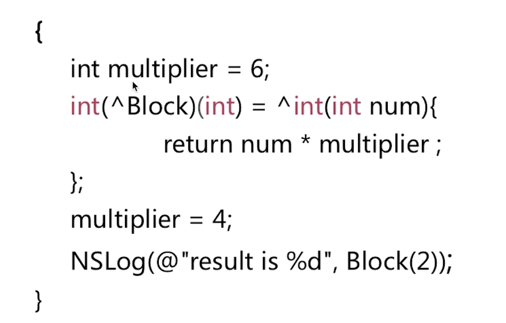

# Block

## 手写Block

typedef void(^BlockA)(NSData *);  
typedef void(^BlockB)(BlockA, NSString *);  
typedef void(^BlockC)(void(^)(NSData *), NSString *);
typedef NSString *(^BlockC)(void(^)(NSData *), NSString *);
@property (nonatomic, copy) void(^blockA)(NSData *);  
@property (nonatomic, copy) void(^blockB)(void(^)(NSData *), NSString *);  
`- (void)func:(void(^)(NSData *))blockA;`  
`- (void)func:(void(^)(void(^)(NSData *), NSString *))blockB;`  
`- (void)func:(BlockA) block;`  
`- (void)func:(BlockB) block;`  
void(^BlockA)(NSData *) = ^void(NSData *data) {
  
};  
void(^BlockB)(void(^)(NSData *), NSString *) = ^void(void(^BlockA)(NSData *data), NSString *str) {

};  

## Block本质

什么是Block？  
Block是将函数及其执行上下文封装起来的对象。  
什么是Block调用？  
Block调用即是函数的调用。

## Block截获变量

结果为12  
multiplier加上static之后结果为8  
multiplier加上__block之后结果为8  
Block截获的变量分类：  

* 局部变量，又分为基本数据类型和对象类型
* 静态局部变量
* 全局变量
* 静态全局变量

1.对于基本类型的局部变量截获其值。  
2.对于对象类型的局部变量连同所有权修饰符一起截获。  
3.以指针形式截获静态局部变量。  
4.不截获全局变量和静态全局变量。  

## __block和__weak

一般情况下，对被截获变量进行赋值操作需要添加__block修饰符。  
对于基本数据类型和对象类型的局部变量需要使用__block进行赋值，对于静态局部变量、全局变量、静态全局变量不需要使用__block修饰符。  
__block修饰的变量变成了对象。  

__forwarding指针是用来干什么的？  

## Block内存管理

Block类型有三种：  

* _NSConcreteGlobalBlock，全局block
* _NSConcreteStackBlock，栈block
* _NSConcreteMallocBlock，堆block

Block的Copy操作：  

栈block拷贝之后到了堆，数据区的block拷贝之后什么也不做，堆block拷贝之后增加引用计数。  

栈上Block的销毁：  

栈上的__block变量和Block在函数作用域结束后都会进行销毁。  

栈上Block的Copy：  

栈上的Block进行Copy操作，在MRC上会内存泄漏

栈上__block变量的Copy：

Block为什么使用copy而不使用strong？  
block变量是在栈上创建的，为了在作用域之外使用block，需要将它拷贝到堆区，而我们对block使用strong也是可以的，因为block的retain默认是用copy实现的，为了保持属性的使用和声明一致，最好使用copy  

__forwarding存在的意义  
不论在任何内存位置，我们都可以顺利的通过__forwarding访问同一个__block变量

## Block循环引用

__block在MRC下，不会产生循环引用。在ARC下，会产生循环引用，引起内存泄漏。

## Block里面self、weakSelf、strongSelf使用

1.不成环，并且想让block代码什么情况下都执行：两种方式：A.全部使用self就行；B.外面定义weak，block里面用strong，也行，多次一举。

2.不成环，并且想让block代码在当前VC释放的情况下不执行：两种方式：A.外面定义weak，里面使用weak，然后注意nil可能会crash的地方（加判断）；B.外面定义weak，block里面使用strong（或者直接使用self），自己加if判断，否是在当前页面，不在当前页面不执行。

3.成环，想让block代码无论如何都执行：必用weak。block里面用strong。

4.成环，想让block代码在当前VC释放的情况下不执行：两种方式：A.必用weak，block里面用strong，则自己加if判断不在当前页面就不执行；B.block里面使用weak，注意nil可能导致crash的地方。

## 代理和block的区别

在应用场景上进行比较，block和代理本质上是不同的，因为block其实是一个对象，代理是一种设计模式。

block优势：  
block代码可读性更好。因为block只要实现就可以了，而代理需要遵守协议并且实现协议里的方法，而两者还不在一个地方。代理使用起来也更麻烦，因为要声明协议、声明代理属性、遵守协议、实现协议里的方法。block不需要声明，也不需要遵守，只需要声明属性和实现就可以了。

block是一种轻量级的回调，可以直接访问上下文，由于block的代码时内联的，运行效率更高。block就是一个对象，实现了匿名函数的功能。所以我们可以把block当做一个成员变量、属性、参数使用，使用起来非常灵活。像AFNetworking请求数据和GCD实现多线程，都使用了block回调。

block劣势：  
block运行成本高。block出栈需要将使用的数据从栈内存拷贝到堆内存，当然对象的话就是引用计数加1，使用完或者block置nil后才销毁。delegate只是保存了一个对象指针，直接回调，没有额外消耗，就像C的函数指针，只多了一个查表操作。  
block容易造成循环引用而不以察觉。因为为了block不被系统回收，所以我们都用copy关键字修饰，实行强引用。block对补货的变量也都是强引用，所以就会造成循环引用。

如何使用：  

* 优先使用block
* 如果回调的状态很多，多余三个使用代理
* 如果回调的很频繁，次数很多，像UITableView，每次初始化、滑动、点击都会回调，使用代理

