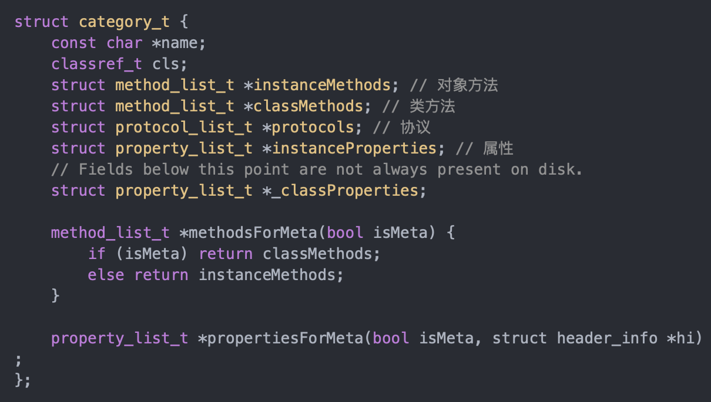

# Objective-C

## 一、数据结构

## 二、分类

问1：你用分类都做了那些事？  
1.声明私有方法，可以在其他类的.m文件中添加分类。  
2.分解体积庞大的类文件，根据功能对类当中的方法进行分类  
3.把framework的私有方法公开化  
问2：分类的特点？  
1.运行时决议，编好分类文件后，并没有把分类当中的内容附加到原类上面，实际上原类还没有分类中对应的方法，而是在运行时通过runtime把分类中的内容真实的添加到对应的原类上面。这是分类和扩展最大的区别  
2.可以为系统类添加分类  
问3：分类可以添加哪些内容？  
1.实例方法  
2.类方法  
3.协议  
4.属性，实际上只是声明了setter和getter方法，并没有添加成员变量  
问4：分类的结构体  
  
name表示分类的名称；cls表示分类所属的宿主类；

## 三、关联对象

## 四、扩展

## 五、代理

## 六、通知

## 七、KVO

## 八、KVC

## 九、属性关键字
