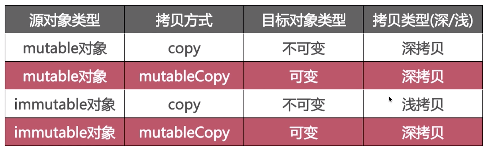

# Objective-C

## 一、分类的数据结构

  
name表示分类的名称；cls表示分类所属的宿主类；

## 二、分类

问1：你用分类都做了那些事？  
1.声明私有方法，可以在其他类的.m文件中添加分类。  
2.分解体积庞大的类文件，根据功能对类当中的方法进行分类  
3.把framework的私有方法公开化  
问2：分类的特点？  
1.运行时决议，编好分类文件后，并没有把分类当中的内容附加到原类上面，实际上原类还没有分类中对应的方法，而是在运行时通过runtime把分类中的内容真实的添加到对应的原类上面，不同分类当中含有同名分类方法，谁最终生效取决于谁最后编译，最后编译的分类方法会最终生效，假如说分类当中的某个方法恰好是宿主类当中的某个方法，分类方法会覆盖同名的宿主类方法，这里所说的覆盖只是由于消息传递优先查找数组靠前的元素，如果找到同名方法就进行调用，但是宿主类中的同名方法还是存在的。这是分类和扩展最大的区别  
2.可以为系统类添加分类  
问3：分类可以添加哪些内容？  
1.实例方法  
2.类方法  
3.协议  
4.属性，实际上只是声明了setter和getter方法，并没有添加成员变量  
问5：分类的加载调用栈
_objc_init -> map_2_images -> map_images_nolock -> _read_images -> remethodizeClass  

## 三、关联对象

问1：能否给分类添加“成员变量”？
id objc_getAssociatedObject(id object, consst void * key)  
void objc_setAssociatedObject(id object, const void * key, id value, objc_associationPolicy policy)
void objc_removeAssociatedObjects(id object)

问2：成员变量被添加到哪里了？  
并没有被添加原宿主类上面，关联对象是由AssociationsManager并在AssociationsHashMap存储，所有类的关联对象都在同一个全局容器中。  

## 四、扩展

问1：扩展的的作用？
1.声明私有属性  
2.声明私有方法  
3.声明私有成员变量

问2：扩展的特点？  
1.编译时决议  
2.只以声明的形式存在，多数情况下寄生在宿主类的.m中  
3.不能为系统类添加扩展

问3：分类跟扩展的区别？
1.分类是运行时决议，扩展是编译时决议  
2.分类有声明和实现，而扩展只有声明，它的实现是写在宿主类当中  
3.可以为系统类添加分类，而不能添加扩展

## 五、代理

问1：什么是代理？
代理是一种软件设计模式，以@protocol的形式存在，代理的传递方式是一对一

## 六、通知

问1：通知的实现原理？
是使用观察者模式来实现的用于跨层传递消息的机制。传递方式为一对多  
问2：如何实现通知机制？
NSNotificationCenter当中维护着一张map表，通过向map表注册key和多个Observer，来实现通知的观察机制。

## 七、KVO

问1：KVO的实现机制？  
KVO是系统对观察者模式的一种实现，使用了isa混写来实现KVO。  
问2：什么是isa混写技术？  
当我们注册一个观察者时，调用addObserverForKeyPath之后，观察者观察对象A当中的某个属性，此时系统为我们在运行时创建一个NSKVONotifying_A的类，将原来A的isa指针指向新创建的类，实际上NSKVONotifying_A是A的子类，之所以继承A，是为了重写属性所对应的setter方法，来达到通知所有所有观察者的目的。  
问3：重写setter方法时添加了什么方法？  
`- (void)willChangeValueForKey:(NSString *)key`  
`- (void)didChangeValueForKey:(NSString *)key`  
`- (void)setValue:(id)obj {`  
&emsp;`[self willChangeValueForKey:@"keyPath"];`  
&emsp;`[super setValue: obj];`  
&emsp;`[self didChangeValueForKey:@"keyPath"];`  
`}`  
问3：通过kvc设置value能否让kvo生效及为什么？  
能。kvc可以调到setter方法上面，setter方法被动态运行时创建的子类重写了，就可以使kvo生效。

问4：通过成员变量直接复制value能否让kvo生效？  
不能。比如objc里面有个increase方法`- (void)increase { _value += 1; }`，当在外部调用increase方法时，发现没有触发系统kvo，我们可以对increase进行一些修改来触发，在修改实例变量时添加will和did方法，或者通过self.xxx来触发，比如  
`- (void)increase {`  
&emsp;`[self willChangeValueForKey: @"value"];`  
&emsp;`_value += 1;`  
&emsp;`[self didChangeValueForKey: @"value"];`  
`}`

## 八、KVC

问1：什么是kvc?
kvc是系统为我们添加的键值编码技术，主要使用两个方法
valueForKey和setValueForKey  
问2：kvc是否违背面向对象思想？  
当我们知道某个类的某个私有变量，我们可以通过kvc来对私有变量进行修改，从这方面考虑的话，它是违背面向对象思想的。  
问3：valueForKey实现流程？  
首先系统会key判断是否有对应的getter方法，如果有，就调用并结束；如果没有，则判断实例变量是否存在，如果存在，直接获取实例变量的值，结束；如果没有，则调用valueForUndefinedKey并抛出异常，结束。  
问4：setValueForKey实现流程？  
首先会判断setter方法是否存在，如果有调用并结束；如果没有则判断实例变量是否存在，如果存在，直接调用实例变量的setValue方法并结束，如果没有，则调用setValueForUndefinedKey并抛出异常，并结束

## 九、属性关键字

读写权限：  
readonly
readwrite为默认
原子性：  
atomic默认，保证赋值和获取是线程安全的，就是说，对成员的直接赋值和获取是线程安全的
noatomic  
引用计数：  
retain/strong修饰对象  
assign/unsafe_unretained,assign既可以修饰对象又可以修饰基本类型
weak  
copy  

问1：self.xxx和_xxx的区别？  
1.self.xxx是访问属性，_xxx是访问实例变量  
2.属性是实例变量加上getter、setter方法的一个整合体，它主要承担一个外部访问的接口  
3.实例变量只能在当前类中才可以访问，外部不可以访问
4.总的原则是在类内部访问的时候用"_"，在类外部也就是其他类离访问这个类的变量时用"."语法  
问2：dynamic和synthesize的区别？
默认是@synthesize var = _var，自动生成成员变量，如果手动实现了setter或者getter方法，那么property就不会自动生成成员变量，此时使用_xxx将会报错，需要显示定义@synthesize var = _var  
@dynamic告诉编译器，属性的setter和getter方法由用户自己实现，不自动生成，如果我们没有实现setter和getter方法，编译时没有问题，使用时将会崩溃
问3：assign和weak的区别？  
1.assign可以修饰对象和基本数据类型，weak只可以修饰对象
2.weak修饰的对象，在引用计数为0时，指针会置为nil，assign修饰的对象会产生野指针  
问5：浅拷贝和深拷贝的区别？
浅拷贝是对内存地址的拷贝，目标指针和源指针指向同一片内存空间  
深拷贝是让目标对象指针和源对象指针分别指向两片内容相同的内存空间  
浅拷贝增加引用计数，深拷贝不增加引用计数  
问6：copy关键字的结果是什么样的？

