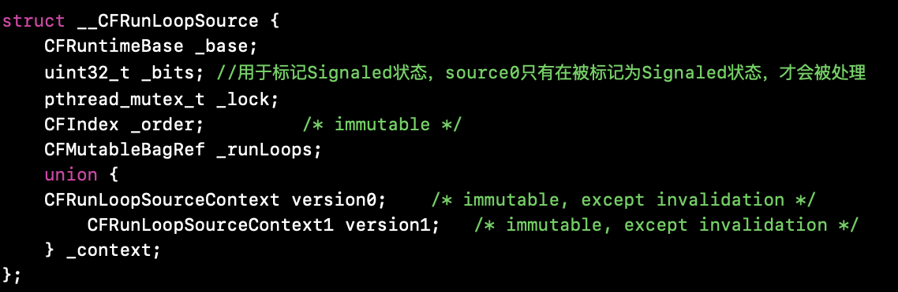

# RunLoop

## RunLoop本质

什么是RunLoop?  
RunLoop是通过内部维护的事件循环来对事件/消息进行管理的一个对象。  
事件循环：

* 没有消息需要处理时，休眠以避免资源占用， 用户态--->内核态
* 有消息需要处理时，立刻被唤醒， 内核态--->用户态

为了系统安全，有些指令只能通过系统来调用，有些指令通过用户来调用，所以就区分出了内核态和用户态。  
当一个进程在执行用户自己的代码时处于用户态，此时特权级最低，为Ring3，当一个进程因为系统调用陷入内核代码中执行时处于内核态，此时特权级最高Ring0，执行的内核代码会使用当前进程的内核栈，每个进程都有自己的内核栈，内核态的进程执行完后又会切换到Ring3，回到用户态。

用户态切换到内核态的3种方式：  

* 系统调用，比如文件读写、网络数据请求
* 异常，当cpu在执行用户态下的程序时，发生了一些不可预知的异常，这是会触发进入处理异常的内核相关进程中，也就切换到了内核态。
* 外围设备的中断，当外围设备发出中断请求信号后，cpu会转到处理中断信号的内核态。

问1：什么是事件循环？  
事件循环可以用来不断处理消息，对他们进行管理，同时当没有消息需要处理时，会从用户态到内核态的切换，由此可以用来进行当前线程的休眠，避免资源占用。当有消息需要处理时，会从内核态切换到用户态，唤醒当前线程。  
问2：main函数为什么能一直保持运行而不退出？  
在main函数中调用的UIApplication会启动主线程的runloop，而runloop是对事件循环的维护机制，可以做到在有事做的时候做事，没事做的时候会发生用户态到内核态的切换，避免资源的占用，当前线程处于休眠状态。

## RunLoop数据结构

NSRunLoop是对CFRunLoop的封装，提供了面向对象的API，NSRunLoop位于Foundation中，CFRunLoop位于CoreFoundation，我们主要来分析CFRunLoop。

RunLoop的运行模式：

* KCFRunLoopDefaultMode，App的默认运行模式，通常主线程是在这个运行模式下运行
* UITrackingRunLoopMode，跟踪用户交互事件（用于ScrollView追踪触摸滑动，保证界面滑动时不受其他mode影响）
* KCFRunLoopCommonModes，伪模式，不是一种真正的运行模式
* UIInitializationRunLoopMode，在刚启动App时进入的第一个Mode，启动完成后就不再使用
* GSEventReceiveRunLoopMode，接受系统内部事件，通常用不到

注意：

* RunLoop只会运行在一个模式下
* 要切换模式，就要暂停当前模式，重新启动一个运行模式

RunLoop主要有三种数据结构：

* CFRunLoop
* CFRunLoopMode
* Source/Timer/Observer

### CFRunLoop

主要包含：pthread、currentMode、modes、commonModes、commonModeItems


从上面可以看出一个RunLoop包含一个线程，也就是和线程是一一对应的；以及若干个Mode、若干个commonModeItem，还有一个当前运行的CurrentMode。如果在RunLoop中需要切换Mode，只能退出Loop，再重新指定一个Mode进入。这样做主要是为了分隔开不同组的Source/Timer/Observer，让其互不影响。

### CFRunLoopMode

主要包含：name、sources0、source1、observers、timers

从上可以看出一个CFRunLoopMode对象有一个name，若干source0、source1、timer、observer和若干port，其中source，timer，observer数据结果被统称为mode item。上面提到的那几种mode（UITrackingRunLoopMode、GSEventReceiveRunLoopMode、kCFRunLoopDefaultMode、kCFRunLoopCommonMode），其实就是这里的name。  

只能通过mode的name字段(也就是字符串)操作内部的Mode，当你传入一个新的mode name但RunLoop内部没有对应mode时，RunLoop会自动帮你创建对应的CFRunLoopModeRef。对于一个RunLoop来说，其内部的mode只能增加不能删除。

source、timer、observer可以再多个mode中注册，但是只有runloop当前的currentMode下的source、timer、observer才可以运行。

Model暴露给外面管理Mode Item的接口：

```C

CFRunLoopAddSource(CFRunLoopRef rl, CFRunLoopSourceRef source, CFStringRef modeName);
CFRunLoopAddObserver(CFRunLoopRef rl, CFRunLoopObserverRef observer, CFStringRef modeName);
CFRunLoopAddTimer(CFRunLoopRef rl, CFRunLoopTimerRef timer, CFStringRef mode);
CFRunLoopRemoveSource(CFRunLoopRef rl, CFRunLoopSourceRef source, CFStringRef modeName);
CFRunLoopRemoveObserver(CFRunLoopRef rl, CFRunLoopObserverRef observer, CFStringRef modeName);
CFRunLoopRemoveTimer(CFRunLoopRef rl, CFRunLoopTimerRef timer, CFStringRef mode);

```

CFRunLoopSource：

__CFRunLoopSource是事件产生的地方。Source有两个版本：Source0和Source1。  

* source0只包含了一个回调（函数指针），source0是需要手动触发的Source，**它并不能主动触发事件，必须要先把它标记为Signal状态。使用时，你需要先调用CFRunLoopSourceSignal(source)，将这个Source标记为待处理，也就是通过uint32_t _bits来实现的**，只有_bits标记为Signaled状态才会被处理。然后手动调用CFRunLoopWakeUp(runloop)来唤醒RunLoop，让其处理这个事件。
* source1包含了一个mach_port和一个回调（函数指针），**被用于通过内核和其他线程互相发送消息。这种Source能主动唤醒RunLoop的线程**。简单来说就更加偏向于底层。

source0：

source1：

source1除了多个了getPort。其余的字段含义和source0相同。作用就是当source被添加到mode中的时候，从这个函数中获得具体mach_port_t。

CFRunLoopTimer：

它和NSTimer是toll-free bridged的([资料可以看这里](https://developer.apple.com/library/archive/documentation/CoreFoundation/Conceptual/CFDesignConcepts/Articles/tollFreeBridgedTypes.html#//apple_ref/doc/uid/TP40010677))，可以混用。其包含一个时间长度和一个回调（函数指针）。当其加入到RunLoop时，RunLoop会注册对应的时间点，当时间点到时，RunLoop会被唤醒以执行那个回调。根据上面的分析一个timer可能会在多个mode中存在。

CFRunLoopObserver：

CFRunLoopObserver是观察者，可以观察RunLoop的各种状态，每个Observer都包含了一个回调（也就是上面的CFRunLoopObserverCallBack函数指针），当RunLoop状态发生变化时，观察者就能通过回调接收到这个变化。状态定义在_CF_OPTIONS：

观察对象为：

* KCFRunLoopEntry，即将进入runloop
* KCFRunLoopBeforeTimers，即将处理timer
* KCFRunLoopBeforeSources，即将处理source
* KCFRunLoopBeforeWaiting，即将进入休眠
* KCFRunLoopAfterWaiting，被唤醒但是还没处理事件
* KCFRunLoopExit，runloop已经退出
* KCFRunLoopAllActivities

### 小结

根据上面的数据结构，总结出如下内容。

一个mode中有多个item，这些item由source、observe、timer组成。对于我们来讲用的最多的应该是observer和timer，常常通过回调来得知当前runloop的状态，进行来优化应用程序（比如监控在waiting状态下，这个时候做一些优化的事情）。其次设置定时器执行定时任务也是很常见的。

一个runloop包含多个mode，但是runloop在一个时间点只会处于一种mode（KCFRunLoopDefaultMode、UITrackingRunLoopMode、）状态下也即是currentMode，如果该当前应用状态在另一种mode下，则该mode下的item（source、observer、timer）就不会工作。

runloop其中有一个commonModes的数组，里面保存的是被标记为common的mode，这种标记为common的mode有种特性，那就是当RunLoop的内容发生变化时，RunLoop都会自动将commonModeItems里的Source/Observer/Timer同步到具有"Common"标记的所有所有Mode里。可以这样理解，runloop中的_commonModeItems由被标记为common的mode下的各个item(source、observer、timer)组成。

Runloop初始化的时候的会把名字为kCFRunLoopDefaultMode、UITrackingRunLoopMode的model加入到common modesls数组里面，标记为common mode。

## RunLoop执行过程


* 如果指定了一个不存在的mode来运行RunLoop，那么会失败，mode不会被创建，所以这里传入的mode必须是存在的。
* 如果指定了一个mode，但是这个mode中不包含任何modeItem，那么RunLoop也不会运行，所以必须传入至少包含一个modeItem的mode
* 在进入runloop之后通知observer，状态为kCFRunLoopEntry
* 在退出runloop之后通知observer，状态为kCFRunLoopExit
* CFRunLoopRun有五个参数：

```C
/**
 *  运行run loop
 *
 *  @param rl              运行的RunLoop对象
 *  @param rlm             运行的mode
 *  @param seconds         run loop超时时间
 *  @param stopAfterHandle true:run loop处理完事件就退出  false:一直运行直到超时或者被手动终止
 *  @param previousMode    上一次运行的mode
 *
 *  @return 返回4种状态
 */
static int32_t __CFRunLoopRun(CFRunLoopRef rl, CFRunLoopModeRef rlm, CFTimeInterval seconds, Boolean stopAfterHandle, CFRunLoopModeRef previousMode) {
  ...
}
```

CFRunLoop是基于pthread来管理的。iOS中不能直接创建RunLoop，只能从系统中获取CFRunLoopGetMain()和CFRunLoopGetCurrent()。

```C
CFRunLoopRef CFRunLoopGetCurrent(void);//获取当前线程的RunLoop对象
CFRunLoopRef CFRunLoopGetMain(void);//获取主线程的RunLoop对象
+(NSRunLoop *)currentRunLoop
+(NSRunLoop *)mainRunLoop
```

获取当前线程RunLoop:

在CFRunLoopGetCurrent函数内部调用了_CFRunLoopGet0(),传入的参数是当前线程，这里可以看出CFRunLoopGetCurrent函数必须要在线程内部调用，才能获取当前线程的RunLoop。也就是说子线程的RunLoop必须要在子线程内部获取。

获取主线程RunLoop:

在CFRunLoopGetMain函数内部也调用了_CFRunLoopGet0(),传入的参数是主线程。可以看出，CFRunLoopGetMain()不管在主线程还是子线程中调用，都可以获取到主线程的RunLoop。

* 线程和RunLoop之间是一一对应的，其关系是保存在一个全局的Dictionary中。
* 线程刚创建时并没有RunLoop（没有加到对应的runloop字典中），如果你不主动获取，那么它一直都不会有
* RunLoop的创建是发生在第一次获取时。一般是获取主线程的时候。
* RunLoop的销毁是发生在线程结束时。
* 只能在一个线程的内部获取其RunLoop（主线程除外），否则这个Runloop就没有注册销毁回调。因为上面讲过Runlopp暴露给外部的创建方式只有CFRunLoopGetMain() 和 CFRunLoopGetCurrent()两种，所以这种情况不用考虑。

```C
CFRunLoopAddCommonMode(CFRunLoopRef rl, CFStringRef mode)//向当前RunLoop的common modes中添加一个mode。
CFStringRef CFRunLoopCopyCurrentMode(CFRunLoopRef rl)//返回当前运行的mode的name
CFArrayRef CFRunLoopCopyAllModes(CFRunLoopRef rl)//返回当前RunLoop的所有mode
```

我们没有办法直接创建一个CFRunLoopMode对象，但是我们可以调用CFRunLoopAddCommonMode传入一个字符串向RunLoop中添加Mode，传入的字符串即为Mode的名字，Mode对象应该是此时在RunLoop内部创建的。**特别注意只能通过CFRunLoopAddCommonMode，是CommonMode**。

* modeName不能重复，modeName是mode的唯一标识符
* 添加commonMode会把commonModeItems数组中的所有item(source,observer,time)同步到新添加的mode中。

**observer和timer只能被添加到一个RunLoop的一个或者多个mode中，比如一个timer被添加到主线程的RunLoop中，则不能再把该timer添加到子线程的RunLoop，而source没有这个限制，不管是哪个RunLoop，只要mode中没有，就可以添加。**

### Block

* block其实在runloop中通过循环链表保存的
* 如果block可以加入到多个mode下面，但是执行block只有在加入的那个mode下才能执行，或者加入mode用common标记
* 每次调用_CFRunLoopDoBlocks，会把加入的block遍历执行，然后重置循环链表

### AutoreleasePool

App启动后，苹果在主线程RunLoop里注册了两个Observer，其回调都是_wrapRunLoopWithAutoreleasePoolHandler()。

第一个 Observer 监视的事件是 Entry(即将进入Loop)，其回调内会调用 _objc_autoreleasePoolPush() 创建自动释放池。其 order 是-2147483647，优先级最高，保证创建释放池发生在其他所有回调之前。

第二个 Observer 监视了两个事件： BeforeWaiting(准备进入休眠) 时调用_objc_autoreleasePoolPop() 和 _objc_autoreleasePoolPush() 释放旧的池并创建新池；Exit(即将退出Loop) 时调用 _objc_autoreleasePoolPop() 来释放自动释放池。这个 Observer 的 order 是 2147483647，优先级最低，保证其释放池子发生在其他所有回调之后。

### 其他使用案例

RunLoop还在手势识别、界面更新(setNeedsLayout/setNeedsDisplay)、定时器、PerformSelctor(延迟执行)、GCD(回调主线程)、网络请求当中发挥了作用。详情参考[这里](http://weslyxl.coding.me/2018/03/18/2018/3/RunLoop从源码到应用全面解析/)

## RunLoop事件循环机制


## RunLoop与多线程

线程时和RunLoop一一对应的。  
自己创建的线程默认是没有RunLoop的。  

怎样实现一个常驻线程呢？  

1. 为当前线程开启一个RunLoop。
2. 向该RunLoop中添加一个Port/Source等维持RunLoop的事件循环。
3. 启动该RunLoop。


什么是RunLoop，它是怎样做到有事做事，没事休息的？  

1. RunLoop是一个事件循环用已处理我们的事件和消息以及对他们的管理。  
2. 是调用CFRunLoopRun之后，会调用系统的mach_msg，同时发生了用户态到内核态的切换，当前线程处于休眠状态，所以做到了有事做事，没事休息。

RunLoop与线程是怎样的关系？  

1. RunLoop与线程一一对应的关系
2. 线程默认是没有RunLoop的，我们需要手动创建

怎样保证子线程数据回来更新UI的时候不打断用户的滑动操作？
