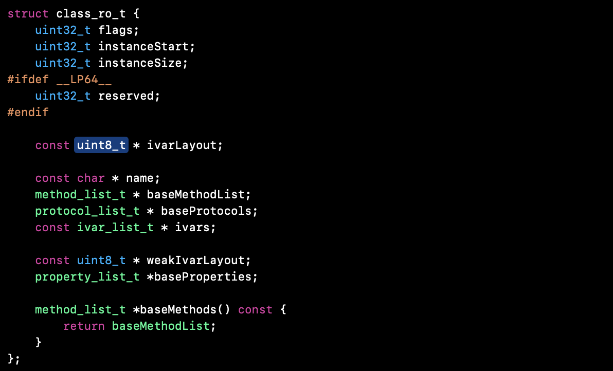
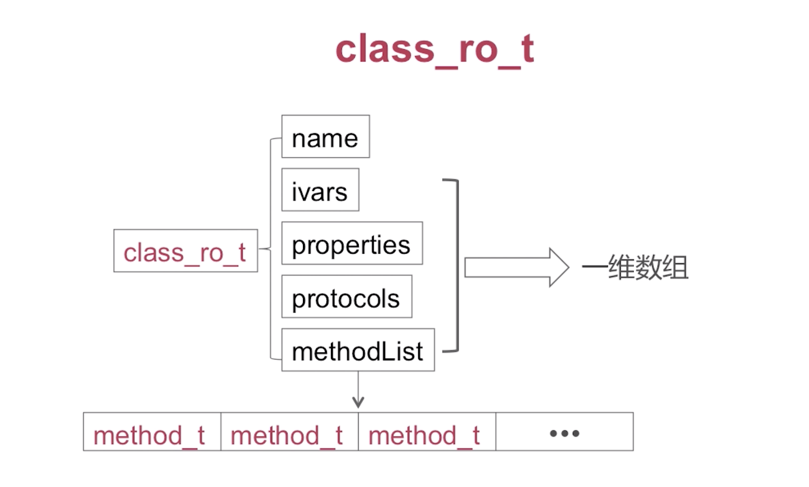

# Runtime

## Runtime数据结构

**objc_object**  
  
isa指针指向它所对应的Class，即类对象
**objc_class**继承至objc_object，是一个类对象
  
superclass指针指向父类对象；cache_t表示方法缓存；class_data_bits_t存了对象的一些信息，比如说方法、属性、协议等等  
因为objc_class继承至objc_object，所以objc_class也有一个isa指针，其指向元类对象
如果我们调用一个实例的实例方法，实际上就是通过实例isa指针到它所对应的类对象当中去查找，如果我们调用的是一个类方法，实际上就是通过类对象的isa指针到它的元类对象当中去查找。  
  
cache_t用于快速查找方法的执行函数,是可增量扩展的哈希表结构,是局部性原理的最佳应用  
cache_t由bucket_t的数组组成，bucket_t由对应的key和imp来实现  
  
class_data_bits_t主要是对class_rw_t的封装，class_rw_t代表了类相关的读写信息（如方法、属性、协议）和对class_ro_t的封装  

class_rw_t主要由四个部分组成：  

* class_ro_t
* protocols
* properties
* methods

1.我们通过分类添加的一些信息都是在protocols、properties和methods当中，这三个数据结构是一个二维数组，他们都继承至list_array_tt，我们以methods为例，methods每个元素都是一个一维数组类型，每个一维数组又存了很多method_t类型的数据结构，图解

method_t的图解：  

properties由property_t组成，property_t图解：

protocols由protocol_ref_t组成，图解：
  

2.class_ro_t代表了类相关的只读信息，由五个部分组成：

* name //类名
* ivars //成员变量
* baseProperties  //属性
* baseProtocols //协议
* baseMethodList //方法列表  

而这里的properties、protocols、methodList都是一维数组，存储的都是原始类当中的一些信息，我们以methodList为例，里面存的是method_t类型的数据结构，跟class_rw_t当中的method_t是一致的，图解：

***  
1.函数四要素：名称、返回值、参数、函数体。和method_t对应关系如图：

types对应于方法签名的type Encodings，如图

***  

## 类对象和元类对象

问1：类对象和元类对象的区别？  
1.类对象存储实例方法列表等信息  
2.元类对象存储类方法列表等信息  

问2：objective-c消息传递的过程？  
当我们调用某个实例的方法时，首先系统会根据当前实例的isa指针找到他的类对象，然后在他的类对象中去遍历方法列表，去查找同名的方法实现，如果没有查找到的话，就会顺次去查找父类的方法列表，然后再顺次去查找根类对象的方法类别，如果没有找到就会进入消息转发流程，后面会介绍消息转发。
当我们调用类方法，就会通过类对象的isa指针找到元类对象，顺次遍历方法列表，直到根元类对象，然后再到根类对象，然后再到nil，进入消息转发流程。  

** 消息传递  

问3：消息传递查找流程？  
调用方法后，先查找缓存，如果缓存中有对应选择器方法的实现，就调用函数指针，完成消息传递，如果缓存中没有，就调用当前类对象的方法列表，如果命中，就通过函数指针进行调用，完成消息传递，如果没有，则逐级在父类对象中进行查找，如果某个父类命中，则通过函数指针调用函数实现，完成消息传递，如果查到根类对象还没有查到，就进入消息转发流程，结束消息传递。

## 方法缓存查找

问1：给你值SEL，目标是对应缓存中bucket_t中的IMP  
通过哈希查找到对应的bucket_t，哈希算法采用是key & mask，其中mask是cache_t的一个成员变量  
问2：当前类中查找方法  
对于已排序好的列表，采用二分查找算法查找方法对应执行函数  
对于没有排序的列表，采用一般遍历查找方法对应执行函数  
问3：缓存查找和当前类中方法查找的区别？  
优先查找缓存，采用哈希查找算法，如果没有命中，就继续查找当前类对象的方法列表，对于已排序的方法列表采用二分查找，对于没有排序的方法列表采用一般遍历查找，如果还没找到，就逐级父类进行查找。

## 消息转发

当向Objective-C对象发送一个消息，但runtime在当前类及父类中找不到此selector对应的方法时，消息转发(message forwarding)流程开始启动。

动态方法解析
向当前类发送+resolveInstanceMethod:(对于类方法则为+resolveClassMethod:)消息，如果返回YES,则系统认为请求的方法已经加入到了，则会重新发送消息。
快速转发路径
如果当前target实现了-forwardingTargetForSelector:方法,则调用此方法。如果此方法返回除nil和self的其他对象，则向返回对象重新发送消息。
慢速转发路径
首先runtime发送-methodSignatureForSelector:消息查看Selector对应的方法签名，即参数与返回值的类型信息。如果有方法签名返回，runtime则根据方法签名创建描述该消息的NSInvocation，向当前对象发送forwardInvocation:消息，以创建的NSInvocation对象作为参数；若methodSignatureForSelector:无方法签名返回，则向当前对象发送doesNotRecognizeSelector:消息,程序抛出异常退出。  

## Method-Swizzling

    Method test = class_getInstanceMethod(self, @selector(test));
    Method otherTest = class_getInstanceMethod(self, @selector(otherTest));
    method_exchangeImplementations(test, otherTest);

## 动态添加方法

## 动态创建类

### 使用objc_allocateClassPair创建一个类Class

    const char * className = "Calculator";
    Class kclass = objc_getClass(className);
    if (!kclass) 
    {
       Class superClass = [NSObject class]; 
       kclass = objc_allocateClassPair(superClass, className, 0);
    }

### 使用class_addIvar添加一个成员变量

    NSUInteger size;
    NSUInteger alignment;
    NSGetSizeAndAlignment("*", &size, &alignment);
    class_addIvar(kclass, "expression", size, alignment, "*");

    注:
    1.type定义参考:https://developer.apple.com/library/mac/#documentation/Cocoa/Conceptual/ObjCRuntimeGuide/Articles/ocrtTypeEncodings.html
    2."*"星号代表字符(),iOS字符为4位，并采用4位对齐kclass

### 使用class_addMethod添加成员方法

class_addMethod(kclass, @selector(setExpressionFormula:), (IMP)setExpressionFormula, "v@:@");
    class_addMethod(kclass, @selector(getExpressionFormula), (IMP)getExpressionFormula, "@@:");

    static void setExpressionFormula(id self, SEL cmd, id value)
    {
       NSLog(@"call setExpressionFormula");
    }

    static void getExpressionFormula(id self, SEL cmd)
    {
        NSLog(@"call getExpressionFormula");
    } 

    注:
    1.type定义参考:https://developer.apple.com/library/mac/#documentation/Cocoa/Conceptual/ObjCRuntimeGuide/Articles/ocrtTypeEncodings.html
    2."v@:@",解释v-返回值void类型,@-self指针id类型,:-SEL指针SEL类型,@-函数第一个参数为id类型
    3."@@:",解释@-返回值id类型,@-self指针id类型,:-SEL指针SEL类型,

### 注册到运行时环境

objc_registerClassPair(kclass);

### 实例化类

id instance = [[kclass alloc] init];

### 给变量赋值

object_setInstanceVariable(instance, "expression", "1+1");

### 获取变量值

  void * value = NULL;
  object_getInstanceVariable(instance, "expression", &value);

### 调用函数

[instance performSelector:@selector(getExpressionFormula)];

## Runtime问题

问1：[obj foo]和objc_msgSend()函数之间有什么关系？  
在编译器编译后会变成objc_msgSend()，然后进行消息传递  
问2：能否向编译后的类中增加实例变量？  
编译前创建的类已经完成了实例变量的布局，从runtime数据结构class_ro_t的只读特性可以看出编译后的类是不能增加实例变量的。  
问3：能否向动态添加的类中增加实例变量？  
可以，因为动态添加类的过程中，只要在注册类对(objc_registerClassPair)之前添加是可以的。
