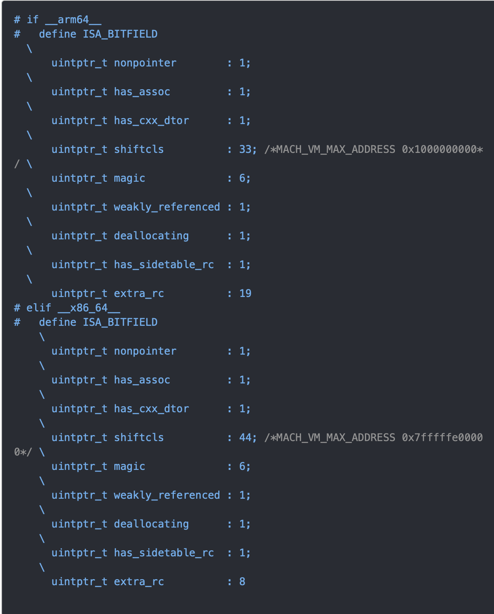

# 内存管理

## 内存布局


stack：方法调用  
heap：通过alloc等分配的对象  
bss：未初始化的全局变量及静态变量等  
data：未初始化的全局变量及静态变量等  
text：程序代码  

### 各类型字符串的关系和存储方式

内存地址由低到高分别为：程序区 -> 数据区 -> 堆区 -> 栈区,其中堆区分配内存地址从低往高分配，栈区分配内存从高往低分配

1.继承关系：
NSTaggedPointerString(栈区) --> NSString
__NSCFConstantString(数据常量区) --> __NSCFString(堆区) --> NSMutableString --> NSString  
2.对于NSStringFromClass()方法，字符串较短的class，系统会对其进行比较特殊的内存管理，NSObject字符串比较短，直接存储在栈区，类型为NSTaggedPointerString，不论你NSStringFromClass多少次，得到的都是同一个内存地址string；但对于较长的class，则为__NSCFString类型，而NSCFString存储在堆区，每次NSStringFromClass都会得到不同内存地址的string  
3.__NSCFConstantString类型的字符串，存储在数据区，即使当前控制器被dealloc释放了，存在于这个控制器的该字符串所在内存仍然不会被销毁。通过快捷方式创建的字符串，无论字符串多长或者多短，都是__NSCFConstantString类型，存储在数据区。  

## 内存管理方案

问1：iOS是怎样对内存进行管理的？  
1.对于一些小的对象，比如较短的NSString采用TaggedPointer方案；NSNumber类型不太确定  
2.64位系统下，对象类型采用NONPOINTER_ISA方案，就是说它的isa指针并不单单是一个指针，其中一些位仍旧编码指向类对象，还有其他的一些位去存储内存管理的信息，比如引用计数、是否被弱引用等等，isa是一个定义的联合体  
3.散列表，散列表是一个hash数组，里面存储了很多个SideTable，散列表的hash键值就是一个对象的address，通过address映射出具体的SideTable，因此可以可以说一个obj，对应了一个SideTable。但是一个SideTable会对应多个obj，就像类跟对象的对应关系差不多。  
SideTable图解：  


### 对NONPONINTER_ISA进行分析


可以看到，x86_64和arm64下的位域定义是不一样的，不过都是占满了所有的64位（1+1+1+33+6+1+1+1+19 = 64，x86_64同理），下面来说明一下每一个位域参数的含义：
nonpointer：表示是否对isa开启指针优化 。0代表是纯isa指针，1代表除了地址外，还包含了类的一些信息、对象的引用计数等。
has_assoc：关联对象标志位
has_cxx_dtor：该对象是否有C++或Objc的析构器，如果有析构函数，则需要做一些析构的逻辑处理，如果没有，则可以更快的释放对象
shiftcls：存在类指针的值，开启指针优化的情况下，arm64位中有33位来存储类的指针
magic：判断当前对象是真的对象还是一段没有初始化的空间
weakly_referenced：是否被指向或者曾经指向一个ARC的弱变量，没有弱引用的对象释放的更快
deallocating：是否正在释放
has_sidetable_rc：当对象引用计数大于10时，则需要进位
extra_rc：表示该对象的引用计数值，实际上是引用计数减一。例如：如果引用计数为10，那么extra_rc为9。如果引用计数大于10，则需要使用has_sidetable_rc

### 散列表方式


问1：为什么不直接用一张SideTable，而是用SideTables去管理多个SideTable？  
SideTable里有一个自旋锁，如果把所有的类都放在同一个SideTable，有任何一个类有改动都会对整个table做操作，并且在操作一个类的同时，操作别的类会被锁住等待，这样会导致操作效率和查询效率都很低。而有多个SideTable的话，操作的都是单个Table，并不会影响其他的table，这就是分离锁。
问2：怎样实现快速分流？  
SideTables的本质是一张Hash表，通过哈希查找找到对应的SideTable

### 散列表相关的数据结构

散列表由三部分组成：自旋锁、引用计数表、弱引用表  
自旋锁spinlock_t：  
spinlock_t是“忙等”的锁。如果当前锁已被其他线程获取，当前线程会不断的探测锁是否被释放，如果被释放，第一时间去获取那个锁。适用于轻量访问。比如对引用计数进行加1减1操作是非常快的，我们可以使用自旋锁。  
问1：自旋锁和普通的锁有什么区别？
自旋锁是忙等的锁，适用于轻量访问。  
引用计数表：  
通过哈希查找，找到对象的引用计数size_t。

弱引用表：
也是一张哈希表


## MRC&ARC

retain，release，retainCount，autorelease只在 mrc下才有。  
alloc，dealloc在mrc和arc下都有  
ARC:
编译器为我们在对应的位置插入retain/release操作，还需要runtime的功能进行支持。由编译器和runtime共同协作组成arc的全部功能。  
ARC禁止手动调用retain/release/retainCount/dealloc  
ARC新增weak/strong属性关键字

## 引用计数管理

alloc实现：经过一系列调用，最终调用了C函数calloc。此时并没有设置引用计数为1，但是获取到的retainCount却是1，这是为何？因为在通过retainCount获取引用计数时，内部默认设置局部变量为1，再加上对象的引用计数，就是最终的结果。  
retain实现：SideTable& table = SideTables()[this];  
size_t& refcntStorage = table.refcnts[this];  
refcntStorage += SIDE_TABLE_RC_ONE;  
两次哈希  
release实现：SideTable& table = SideTables()[this];  
RefcountMap::iterator it = table.refcnts.find(this);  
it->second -= SIDE_TABLE_RC_ONE;  
retainCount实现：SideTable& table = SideTables()[this];  
size_t refcnt_result = 1;  //这里可以看出alloc之后为什么引用计数为1
RefcountMap::iterator it = table.refcnts.find(this);  
refcnt_result += it->second >> SIDE_TABLE_RC_SHIFT;  
dealloc实现：  

object_dispose()实现：

objc_destructInstance()实现：

clearDeallocating()实现：


## 弱引用管理

思考：weak变量是怎样被添加到弱引用表当中的？
例如：


一个被声明为__weak的对象指针，经过编译器的编译之后调用objc_initWeak()，然后经过一系列的函数调用栈，最终在weak_register_no_lock函数当中进行弱引用变量的添加，具体添加的位置是通过哈希算法进行位置查找的，如果说我们查找对应位置当中已经有了这个当前对象所对应的弱引用数组，我们就把新的弱引用变量添加到这个数组当中，如果没有，我们就创建一个弱引用数组，然后把第0个位置添加我们最新的weak指针，后面的初始化为nil。  
思考2：当一个对象被释放或者废弃之后，weak变量是怎样处理的？
调用dealloc()时，内部经过一系列的调用，最终调用弱引用清除函数weak_clear_no_lock()，函数内部根据当前对象指针查找弱引用表，把当前对象相对应的弱引用拿出来，是一个数组，遍历这个数组中的所有弱引用指针，分别置为nil。


## 自动释放池

编译器会将@autoreleasepool{}改写为：  

```C
  void *ctx = objc_autoreleasePoolPush();
  { }中的代码
  objc_autoreleasePoolPop(ctx);
```

objc_autoreleasePoolPush内部实现：调用void* AutoreleasePoolPage:push(void)这个c++方法

objc_autoreleasePoolPop内部实现：调用void* AutoreleasePoolPage:pop(void* ctxt)这个c++方法

一次pop实际上相当于一次批量的pop操作，怎么理解呢？  
也就是说{}括号中的对象都会进行一次pop操作  
***  
autoreleasePool的实现原理是怎样的？  
自动释放池实际上是以栈为节点，通过双向链表的形式组合而成的数据结构。是和线程一一对应的。  
autoreleasePool释放时机？  
自动释放池是在准备进入休眠或将要结束的时候调用pop释放。  
双向链表结构：

栈结构：

AutoreleasePoolPage：


调用[obj autorelease]的实现：

AutoreleasePoolPage::pop实现：  
1.根据传入的哨兵对象找到对应位置；  
2.给上次push操作之后添加的对象一次发送release消息  
3.回退next指针到正确位置。  
autoreleasePool的使用场景：  
1.写基于命令行的程序时，就是没有UI框架，如AppKit等Cocoa框架时。  
2.写循环，循环里面包含了大量临时创建的对象。  
3.创建了新的线程。（非Cocoa程序创建线程时才需要）  
4.长时间在后台运行的任务  
***  

问1：
问2：autoreleasePool为何可以嵌套使用？  
多层嵌套就是多次插入哨兵对象。
问3：autoreleasePool使用场景？  
在for循环中alloc图片数据等内存消耗较大的场景手动插入autoreleasePool。

## 循环引用

问1：循环引用的种类？  

1. 自循环引用  A.obj = A
2. 相互循环引用  
3. 多循环引用  

循环引用考点：  

* 代理
* Block
* NSTimer
* 大环引用

如何破除循环引用？  

* 避免产生循环引用
* 在合适的时机手动断环
  
具体解决方案？

* __weak
* __block
* __unsafe_unretained


在MRC下，__block修饰的对象不会增加其引用计数，避免了循环引用。  
在ARC下，__block修饰的对象会被强引用，无法避免循环引用，需要手动解环。  
__unsafe_unretained修饰的对象不会增加其引用计数，避免了循环引用。如果被修饰对象在某一时机被释放，会产生野指针。

问2：你在实际开发过程中是否遇到过循环引用？你是怎样解决循环引用的？  

* Block循环引用
* NSTimer循环引用  

NSTimer的循环引用问题：  
类有一个成员变量_timer，timer的target由强引用了这个类本身，就会出现循环引用，最后导致无法正确释放。解决这个问题的方式也很简单，当类的使用者能够确定不需要使用这个定时器时，调用[timer invalidate]和timer = nil即可，但是这种依赖于开发者手动调用方法才能让内存正确释放的方式不是一个好的处理方式。  
解决NSTimer循环引用的方法由三种：  

* 使用block方法
* 使用weakProxy

block方式：

weakProxy方式：

