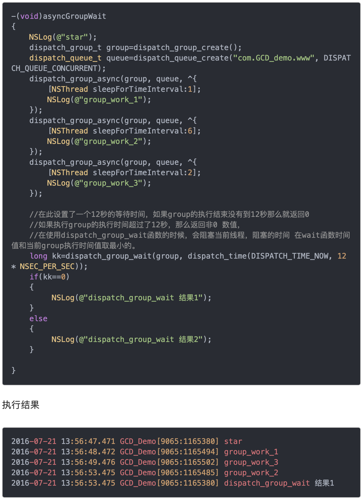
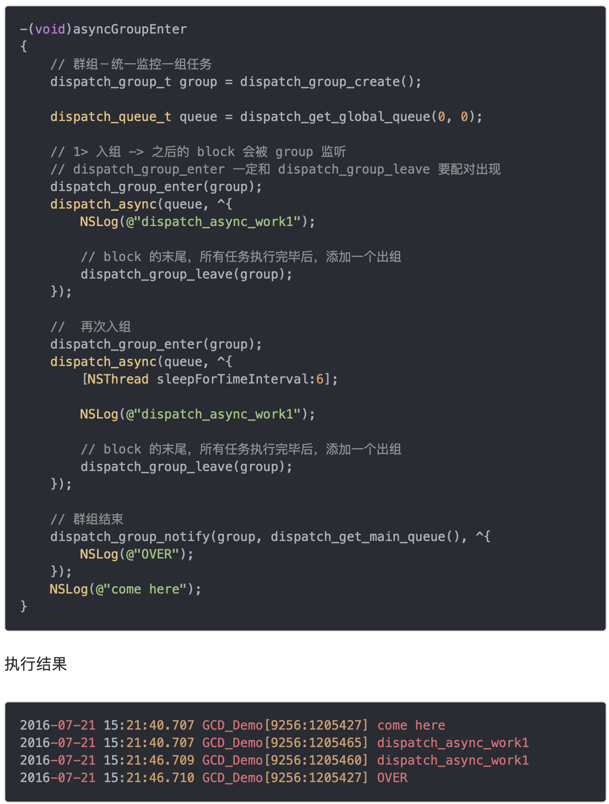
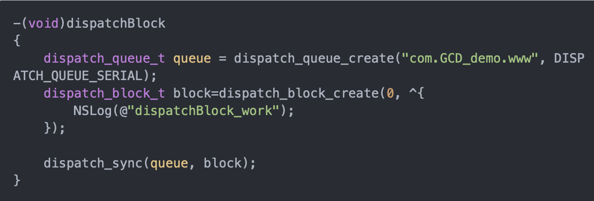
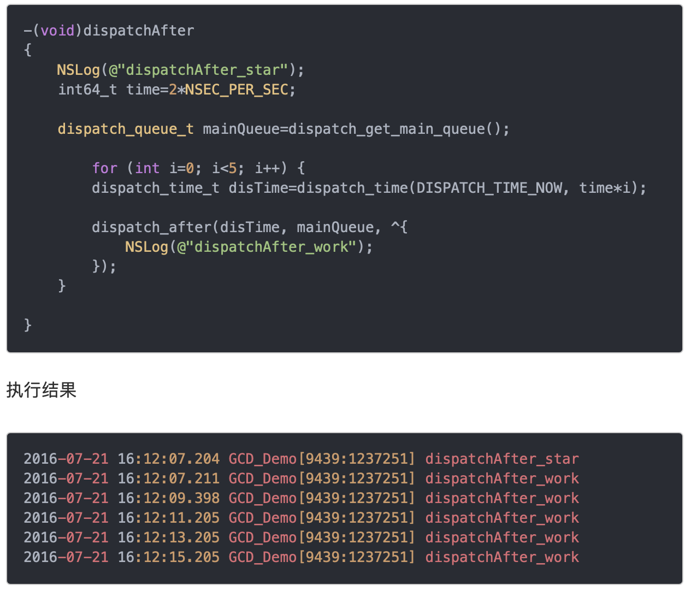
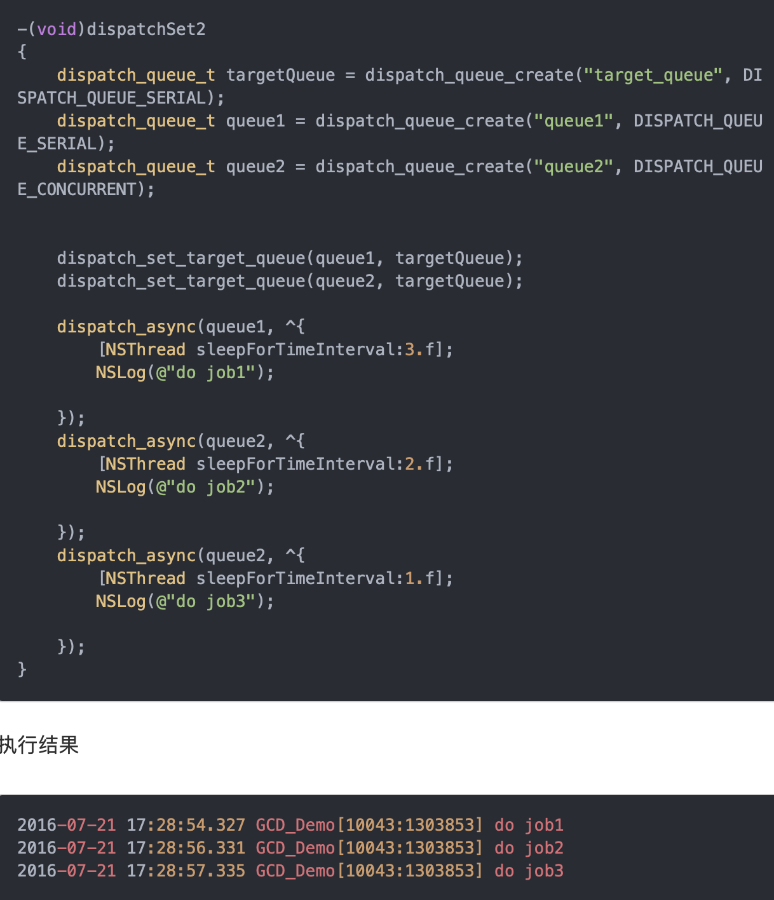

# 多线程

## GCD

同步/异步和串行/并行，有四种组合

* dispatch_sync(serial_queue, ^{//任务});     //同步串行
* dispatch_async(serial_queue, ^{//任务});    //异步串行
* dispatch_sync(concurrent_queue, ^{//任务}); //同步并行
* dispatch_async(concurrent_queue, ^{//任务});//异步并行

### 同步串行

```Objective-C
- (void)viewDidLoad {
  dispatch_sync(dispatch_get_main_queue(), ^{
      [self doSomething];
  });
}
```

上面会发生死锁，死锁原因：  
由队列引起的循环等待，而不是线程引起的循环等待。


### 异步串行

```Objective-C
- (void)viewDidLoad {
  dispatch_async(dispatch_get_main_queue(), ^{
      [self doSomething];
  });
}
```


没有问题

### 同步并行


### 异步并行

```Objective-C
- (void)viewDidLoad {
    [super viewDidLoad];
    // Do any additional setup after loading the view.

    dispatch_async(dispatch_get_global_queue(0, 0), ^{
        NSLog(@"1");
        [self performSelector:@selector(printLog) withObject:nil afterDelay:0];
        NSLog(@"3");
    });
}

- (void)printLog {
    NSLog(@"2");
}
```

上面的代码将只打印1和3，performSelecter:afterDelay: 来实现延迟执行，实际上其内部会创建一个 Timer 并添加到当前线程的 RunLoop 中。所以如果当前线程没有 RunLoop，则这个方法会失效。


### dispatch和线程之间的关系

dispatch_queue_t queue = dispatch_queue_create(label, attr);  
label起标识作用  
attr值有两个DISPATCH_QUEUE_CONCURRENT 和 DISPATCH_QUEUE_SERAIL（或者NULL）  

1. 无论attr的值是concurrent还是serial，当在主线程中调用dispatch_sync(queue, block)的时候，block代码将在主线程中执行。
2. 当调用dispatch_async(queue, block)的时候，block代码将在新的线程中执行。如果queue为mainQueue，则还是主线程中执行。  
（1），当queue的attr是 serail的时候，多次dispatch_async(queue, block2),这些block将在同一个线程中执行。  
（2）， 当queue的attr是concurrent的时候，多次dispatch_async(queue, block2),这些block将在不同的线程中执行。  

图解：


## Dispatch Group

### dispatch_group_notify

当我们想在gcd queue中所有的任务执行完毕之后做一些特定事情的时候，也就是队列的同步问题，如果队列是串行的话，那将该操作最后添加到队列中即可，如果队列是并行队列的话，这时候就可以利用dispatch_group来实现了，dispatch_group能很方便的解决同步问题。dispatch_group_create可以创建一个group对象，然后可以添加block到该组里面


### dispatch_group_wait



### dispatch_group_enter&dispatch_group_leave

如果我们不想使用dispatch_group_async异步的将任务丢到group中去执行，这时候就需要用到dispatch_group_enter跟dispatch_group_leave方法，这两个方法要配对出现。


### dispatch_block_t

添加到gcd队列中执行的任务是以block的形式添加的，block封装了需要执行的功能，block带来的开发效率提升就不用说了，gcd跟block可以说是一对好基友，能够很好的配合使用。


### dispatch_block_wait

当需要等待前面的任务执行完毕时，我们可以使用dispatch_block_wait这个接口，设置等待时间DISPATCH_TIME_FOREVER会一直等待知道前面的任务完成。用法跟dispatch_group_wait类似


### dispatch_block_notify

dispatch_block_notify当观察的某个block执行结束之后立即通知提交另一特定的block到指定的queue中执行，该函数有三个参数，第一个参数是需要观察的block，第二个参数是被通知block提交执行的queue，第三个参数是当需要被通知执行的block


### dispatch_block_cancel

可以取消提交到队列的block


### dispatch_after

来延迟执行的GCD方法，因为在主线程中我们不能用sleep来延迟方法的调用，所以用它来是最合适的。


### dispatch_apply

dispatch_apply类似一个for循环，会在指定的dispatch queue中运行block任务n次，如果队列是并发队列，则会并发执行block任务，dispatch_apply是一个同步调用，block任务执行n次后才返回。


### dispatch_once

整个程序运行中只会执行一次，使用dispatch_once可以简化代码并且彻底保证线程安全，开发者根本无须担心加锁或者同步。所有问题都由GCD在底层处理。由于每次调用时都必须使用完全相同的标记，所以标记要声明成static。所以用在单例模式上是最好的。


### dispatch_barrier_async

dispatch_barrier_async用于等待前面的任务执行完毕后自己才执行，而它后面的任务需要等待它完成之后才执行。一个典型的例子就是数据的读写，通常为了防止文件读写导致冲突，我们会创建一个串行的队列，所有的文件操作都是通过这个队列来执行，比如FMDB，这样就可以避免读写冲突。不过其实这样效率是有提升的空间的，当没有数据更新时，读操作其实是可以并行进行的，而写操作需要串行的执行。


多读单写实现：  


### dispatch_set_target_queue

1. 系统的Global Queue是可以指定优先级的，那我们可以用到dispatch_set_target_queue这个方法来指定自己创建队列的优先级

2. dispatch_set_target_queue除了用来设置队列的优先级之外，还能够创建队列的层次体系，当我们想让不同队列中的任务同步的执行时，我们可以创建一个串行队列，然后将这些队列的target指向新创建的队列即可。


## NSOperation

NSOperation是个抽象类，不能用来封装操作。我们只有使用它的子类来封装操作。我们有三种方式来封装操作。

* 使用子类NSInvocationOperation
* 使用子类NSBlockOperation
* 自定义继承自NSOperation的子类，通过实现内部相应的方法来封装操作。

任务执行状态：

* isReady
* isExecuting
* isFinished
* isCancelled

如果只重写main方法，底层控制变更任务执行完成状态，以及任务退出。isExecuting 和 isFinished，当main执行完之后，这个操作就结束了。
如果重写了start方法，自行控制任务状态。

问：系统是怎样移除一个isFinished = YES的NSOperation的？  
通过KVO移除NSOperationQueue中的NSOperation

## NSThread

启动流程：

Start方法：  
判断状态  --  创建pthread  --->  调用线程main函数 --->  退出  
main函数实现：
异常判断 -->调用target的SEL

## 多线程与锁

