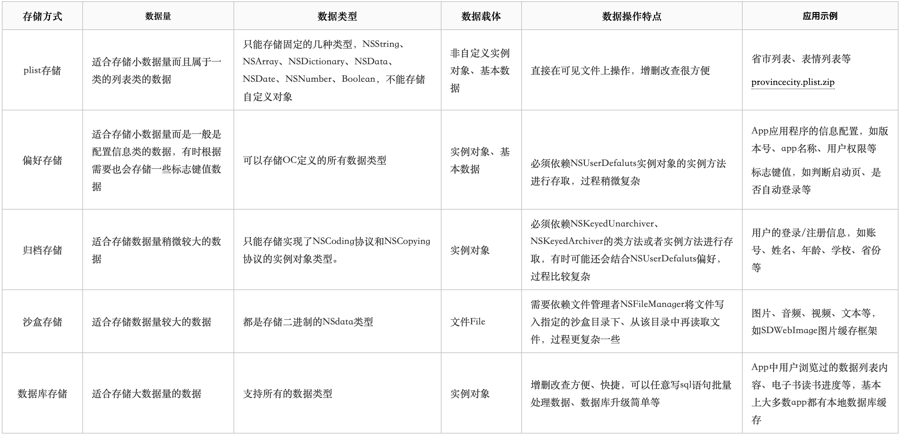

# 数据持久化

## 沙盒路径

* Documents
* Library
* Caches
* Preferences
* SystemData
* tmp

Document  
会备份，一般用来存储需要持久化的数据。一般我们在项目中，我们会把一些用户的登录信息进行存储，以及搜索历史记录等等关键数据。

Library  
Library里面包含两个文件夹(Caches和Preferences)  
Caches  
缓存，iTUnes不会备份该目录。内存不足时会被清楚，应用没有运行时，可能会被清楚。一般存储体积大、不需要备份的非重要数据。  
Preferences  
保存持久化数据，会备份  
NSUserDefaults默认存放在此文件夹

SystemData  

tmp
临时文件夹，iTUnes不会备份这个目录，用来保存临时数据，应用退出时可能会清楚该目录下的数据，一般开发者需要临时保存的数据但不需要长期保留使用可以放到此文件夹

## 数据持久化种类

* property list(属性列表)
* Preference(偏好设置)
* NSKeyedArchiver(归档)
* SQlite3/FMDB(嵌入式数据库)
* CoreData(面向对象的嵌入式数据库)

property list  
只能存储系统自带的数据类型，一般实际开发中存储字典、数组，自定义的模型无法进行存储

Preference  
只能存储系统自带的数据类型，自定义的对象无法存储。  
例如存储NSUserDefaults，NSUserDefault只能存取NSString、NSSArray、NSDictionary、NSData、NSNumber等类型。  
偏好设置是专门用来保存应用程序的配置信息的，一般不要在偏好设置中保存其他数据。  
如果没有调用synchronize方法，系统会根据I/O情况不定时刻地保存到文件中。所以如果需要立即写入文件的就必须调用synchronize方法。  
偏好设置会将所有数据保存在同一个文件中。即Preference目录下的一个以此应用包名来命名的plist文件。

NSKeyedArchiver  
归档，又名序列化，把对象转成字节码，以文件的形式存储到磁盘上，程序运行过程中或者再猜重新打开程序的时候，可以通过解归档（反序列化）还原这些对象。  
归档的对象是Foundation框架中的对象  
归档和解归档其中任意对象都需要归档和解归档整个文件  
归档后的文件是加密的，所以归档文件的扩展名可以随意取  
在带键的归档中，每个归档都有一个key值，解归档时key值要与归档时key值匹配  
如果一个自定义的类A，作为另一个自定义类B的一个属性存在；那么如果要对B进行归档，那么，B要实现NSCoding协议。并且，A也要实现NSCoding协议  

SQLite  
SQLite数据库的几个特点：  
基于C语言开发的轻型数据库  
在iOS中需要使用C语言语法进行数据库操作、访问（无法使用ObjC直接访问，因为libsqlite3框架基于C语言编写）

SQLite中采用的是动态数据类型，即使创建时定义了一种类型，在实际操作时也可以存储其他类型，但是推荐建库时使用合适的类型  
建立连接后通常不需要关闭连接（尽管可以手动关闭）  
在iOS中操作SQLite数据库可以分为以下几个步骤：  
打开数据库，利用sqlite3_open()打开数据库会指定一个数据库文件保存路径，如果文件存在则直接打开，否则创建并打开。打开数据库会得到一个sqlite3类型的对象，后面需要借助这个对象进行其他操作。  
执行SQL语句，执行SQL语句又包括有返回值的语句和无返回值的语句。  
对于无返回值的语句（如增加、删除、修改等）直接通过sqlite3_exec()函数执行；  
对于有返回值的语句则首先通过sqlite3_prepare_v2()进行sql语句评估（语法检测），然后sqlite3_step()依次取出查询结果的每一行数据，对于每行数据都可以通过对应的sqlite3_column_类型()方法获得对应列的数据，如此返回循环直到遍历完成。当然，最后需要释放句柄。

索引：  
使用索引的全部意义就是通过缩小一张表中需要查询的记录/行的数目来加宽搜索的速度。  
什么是索引？  
一个索引是存储的表中一个特定列的值数据结构(最常见的是B-Tree)。索引是在表的列上创建。所以，要记住的关键点是索引包含一个表中列的值，并且这些值存储在一个数据结构中。请记住这一点：索引是一种数据结构。  
什么样的数据结构可以作为索引？  
B-Tree是最常见的用于索引的数据结构。因为它们是时间复杂度低，查找、删除、插入操作都可以在对数时间内完成。另外一个重要原因存储在B-Tree中的数据是有序的。数据库管理系统通常决定索引应该用哪些数据结构。但是，在某些情况下，你在创建索引时可以指定索引要使用的数据结构。  
哈希表索引时怎么工作的？  
哈希表是另外一种你可能看到用作索引的数据结构-这些索引通常被称为哈希索引。使用哈希索引的原因是，在寻找值时哈希表效率极高。所以，如果使用哈希索引，对于比较字符串是否相等的查询能够极快的检索出值。  
哈希索引的缺点  
哈希表是无顺序的数据结构，对于很多类型的查询语句哈希索引都无能为力。距离来说，加入你想要找出所有小于40岁的员工。你怎么使用哈希索引进行查询？这不可行，因为哈希表只适合查询键值对-也就是说查询相等的查询（例如：like "WHERE name = 'Jesus'）。哈希表的键值映射也暗示其键的存储是无序的。这就是为什么哈希索引通常不是数据库索引的默认数据结构-因为在作为索引的数据结构时，其不想B-Tree那么灵活  
还有什么其他类型的索引？  
使用R-Tree作为数据结构的索引通常用来为空间问题提供帮助。例如，一个查询要求“查询出所有距离我两公里內的星巴克”，如果数据库表使用R-Tree索引，这类查询的效率将会提高。  
另外一种索引是位图索引(bitmap index)，这类索引适合放在包含布尔值(true和false)的列上，但是这些值(表示true或false的值)的许多实例-基本上都是选择性低的列。

打开数据库  

```C
if(sqlite3_open(filePath.UTF8String, &_database) == SQLite_OK) {
  NSLog(@"数据库打开成功");
}
```

执行无返回结果的SQL

```C
if(sqlite3_exec(_database, sql.UTF8String,NULL,NULL,&error) != SQLITE_OK) {
  NSLog(@"执行SQL语句过程中发生错误，错误信息: %s",error);
}
```

执行有返回结果的SQL

```C
sqlite3_stmt *stmt;
if(sqlite3_prepare_v2(_database,sql.UTF8String,-1,&stmt,NULL) == SQLITE_OK) {
  while(sqlite3_step(stmt) == SQLITE_ROW) {
    int columnCount = sqlite3_column_count(stmt);
    NSMutableDictionary *dic = [NSMutableDictionary dictionary];
    for (int i = 0; i < columnCount; i++) {
      const char *name = sqlite3_column_name(stmt, i);
      const unsigned char *value = sqlite3_column_text(stmt, i);
      [dict setValue:[NSString stringWithUTF8String:(const char *)value] forKey: [NSString stringWithUTF8String:name]];
    }
    [rows addObject:dic];
  }
  sqlite3_finalize(stmt);
}
```

CoreData  
CoreData是iOS5之后才出现的一个框架，它提供了对象-关系映射（ORM）的功能，即能够将OC对象转化成数据，保存在SQLite数据库文件中，也能够将保存在数据库中的数据还原成OC对象。再次数据操作期间，我们不需要编写任何SQL语句  
简介  
Core Data是个框架（并不是数据库哦），它使开发者可以把数据当做对象来操作，而不必在乎数据在磁盘中的存储方式。对应iOS程序员来说，这很有用，因为我们已经可以通过代码非常熟悉的操作对象了。由Core Data所提供的数据对象叫做托管对象（Managed Object），而Core Data本身则位于你的应用程序和持久化存储区（Persistent store）之间。为了把数据从托管对象映射到持久化存储区中，Core Data需要使用托管对象模型。所有的托管对象都必须位于托管对象上下文（Managed object context）里面，而托管对象上下文又位于告诉的易市性存储器里面，也就是位于RAM中。  
为什么需要有托管对象上下文呢？原因之一就是在托管于RAM之间传输数据时会有开销。磁盘读写速度比RAM慢得多，所以不应该频繁地访问它。有了托管对象上下文，就可以非常讯速地获取到了。但它的缺点在于，开发者必须在托管对象上下文上面定期调用save方法，以将变更后的数据写回磁盘。托管对象上下文的另一个功能是记录开发者对托管对象所对的修改，以提供完整的撤销和重做支持。  

## 数据持久化区别



## 第三方持久化方案

FMDB  

FMDatabase主要的两个方法：  
executeUpdate和executeQuery

```Objective-C
    dispatch_group_t group = dispatch_group_create();
    dispatch_queue_t queue = dispatch_get_global_queue(0, 0);
    [_db open];
    dispatch_group_async(group, queue, ^{
        FMDatabaseQueue *queue = [FMDatabaseQueue databaseQueueWithPath:self.dbPath];
        [queue inDatabase:^(FMDatabase * _Nonnull db) {
            BOOL result = [db executeUpdate:@"insert into 't_student'(ID,name,phone,score) values(?,?,?,?)" withArgumentsInArray:@[@134,@"x3",@"13",@"53"]];
        }];
    });
    dispatch_group_async(group, queue, ^{
        FMDatabaseQueue *queue = [FMDatabaseQueue databaseQueueWithPath:self.dbPath];
        [queue inDatabase:^(FMDatabase * _Nonnull db) {
            BOOL result = [db executeUpdate:@"insert into 't_student'(ID,name,phone,score) values(?,?,?,?)" withArgumentsInArray:@[@144,@"x3",@"13",@"53"]];
        }];
    });
    dispatch_group_async(group, queue, ^{
        FMDatabaseQueue *queue = [FMDatabaseQueue databaseQueueWithPath:self.dbPath];
        [queue inDatabase:^(FMDatabase * _Nonnull db) {
            BOOL result = [db executeUpdate:@"insert into 't_student'(ID,name,phone,score) values(?,?,?,?)" withArgumentsInArray:@[@146,@"x3",@"13",@"53"]];
        }];
    });
    dispatch_group_notify(group, queue, ^{
        NSLog(@"完成 - %@", [NSThread currentThread]);
        [self.db close];
    });
```

Realm-cocoa

* Realm是用于移动端的数据库，目前支持iOS和Android平台，它相比于SQLite和CoreData使用简单，学习成本低，性能跟高效。
* Realm不是基于Core Data，也不是基于SQLite封装构建的。它有自己的数据库存储引擎。
* 由于Realm在自己的引擎内部有很好的语义解释系统，所以Objective-C的许多属性特性将被忽略，如nonatomic,atomic,storng,copy和weak等。编写数据模型的时候不要使用任何的属性特性。

