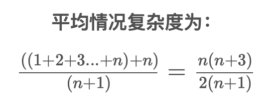
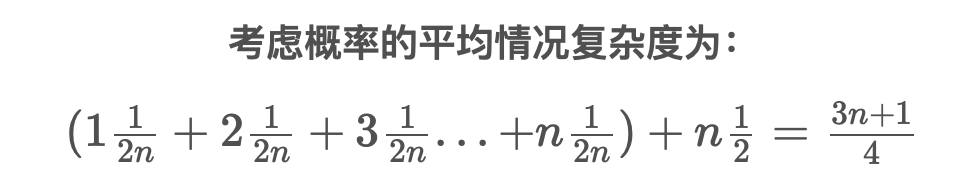
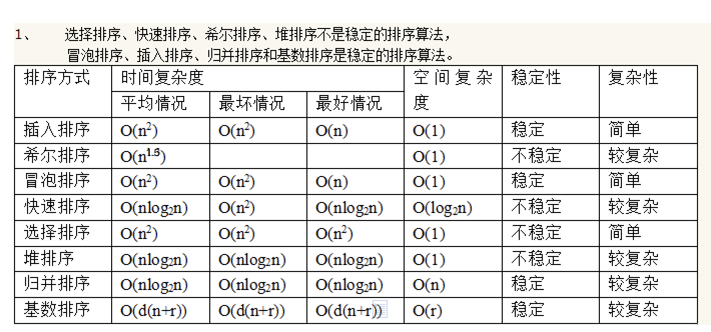

# 算法

[数据结构与算法系列](https://www.cnblogs.com/skywang12345/p/3603935.html)

## 时间复杂度和空间复杂度

算法是用来操作数据、解决程序问题的一组方法。对于同一个问题，使用不同的算法，也许最终得到的结果是一样的，但在过程中消耗的资源和时间却会有很大的区别。

那么我们应该如何衡量不同算法之间的优劣呢？  

只要还是从算法所占用的“时间”和“空间”两个维度去考量。  

时间维度：是指执行当前算法所消耗的时间，我们通常用“时间复杂度”来描述。  
空间维度：是指执行当前算法需要占用多少内存空间，我们通常用“空间复杂度”来描述。  
因此，评价一个算法的效率主要是看他的时间复杂度和空间复杂度情况。然而，有的时候时间和空间却又是“鱼和熊掌”，不可兼得的，那么我们就需要从中取一个平衡点。  
下面我来分别介绍一下“时间复杂度”和“空间复杂度”的计算方式。

时间复杂度  
我们想要知道一个算法的时间复杂度，很多人首先相当的方法就是把这个算法程序运行一遍，那么它所消耗的时间就自然而然知道了。  
这种方式可以吗？当然可以，不过它也有很多弊端。  
这种方式非常容易受运行环境的影响，在性能高的机器上跑出来的结果与在性能低的机器上跑的结果相差会很大。而且对测试时使用的数据规模也有很大关系。再者，并我们在写算法的时候，还没有办法完整的去运行呢。

因此，另一种更为通用的方法就出来了：“大O符号表示法”，即T(n)=O(f(n))

我们先来看个例子：

```C
for (i=1; i <= n; ++i) {
  j = i;
  j++;
}
```

通过“大O符号表示法”，这段代码的时间复杂度为：O(n)，为什么呢？  
在大O符号表示法中，时间复杂度的公式是：T(n) = O(f(n))，其中f(n)表示每行代码执行次数之和，而O表示正比例关系，这个公式的全称是：算法的渐进时间复杂度。

我们继续看上面的例子，假设每行代码的执行时间都是一样的，我们用1颗粒时间来表示，那么这个例子的第一行耗时是1个颗粒时间，第三行的执行时间是n个颗粒时间，

常见的时间复杂度量级有：

* 常数阶O(1)
* 对数阶O(logN)
* 线性阶O(n)
* 线性对数阶O(nlogN)
* 平方阶O(n^2)
* 立方阶O(n^3)
* K次方阶O(n^k)
* 指数阶O(2^n)

细化时间复杂度：  

* 最好情况时间复杂度
* 最坏情况时间复杂度
* 平均情况时间复杂度
* 均摊时间复杂度

```java
public int Function(int n, int x) {
  int sum = 0;
  for (int i = 1; i <= n; ++i) {
    if (i == x) {
      break;
    }
    sum += i;
  }
  return sum;
}
```

这段代码根据x值得不同，时间复杂度也有区别：  

1. 当x > n时，次diamante的时间复杂度是O(n)。
2. 当1<=x<=n时，时间复杂度是一个我们不确定的值，取决于x的值。
3. 当x = 1时，时间复杂度是O(1)。

这段代码在不同情况下，其时间复杂度是不一样的。所以为了描述代码在不同情况下的不同时间复杂度，我们引入最好、最坏、平均时间复杂度。  

最好情况时间复杂度  
最好情况时间复杂度，表示在最理想情况下，执行这段代码的时间复杂度。  
上述实例就是当x = 1的时候，循环的第一个判断就跳出，这个时候对应的时间复杂度就是最好情况时间复杂度。

最坏情况时间复杂度  
最坏情况时间复杂度，表示在最糟糕的情况下，执行这段代码的时间复杂度。  
上述实例就是x > n的时候，我们要把整个循环执行一遍，这个时候对应的时间复杂度就是最坏情况时间复杂度。

平均情况时间复杂度  
最好和最坏情况是极端情况，发生的概率并不大。为了更有效的表示平均情况下的时间复杂度，引入另一个概念：平均情况时间复杂度。  
分析上面的实例代码，判断x在循环中出现的位置，有n+1种情况：1<=x<=n和x>x。  
我们将所有情况下代码执行的次数累加起来((1+2+3+...+n)+n)，然后再除以所有情况数量(n+1)，就可以得到需要遍历次数的平均值。

大O表示法，会省略系数、低阶、常量，所以平均情况时间复杂度是O(n)。  
但是这个平均复杂度没有考虑各自情况的发生概率，这里的n+1个情况，他们的发生概率是不一样的，所以还需要引入各自情况发生的概率再具体分析。  
x要么在1~n中，要么不在1~n中，所以他们的概率都是1/2。  
同时数据在1~n中各个位置的概率都是一样为1/n。根据概率乘法法则，x在1~n中任意位置的概率是1/2n。  
因此在前面推倒过程的基础上，我们把每种情况发生的概率考虑进去，那么平均情况时间复杂度的计算过程变为：

这就是概率论中的加权平均值，也叫做期望值，所以平均时间复杂度全称叫：加权平均时间复杂度或者期望时间复杂度。  
引入概率之后，平均复杂度变为O((3n+1)/4)，忽略系数及常量后，最终得到加权平均时间复杂度为O(n)。  

均摊情况时间复杂度  
均摊复杂度是一个更加高级的概念，它是一种特殊的情况，应用的场景也更加特殊和有限。  
对应的分析方式成为：摊还分析或平摊分析  

空间复杂度  

```C
int[] m = new int[n]
for(i=1; i<=n; ++i)
{
   j = i;
   j++;
}
```

这段代码中，第一行new了一个数组出来，这个数据占用的大小为n，这段代码的2-6行，虽然有循环，但没有再分配新的空间，因此，这段代码的空间复杂度主要看第一行即可，即O(n)  

## 九种排序算法

### 选择排序

首先在未排序的数列中找到最小(or最大)元素，然后将其存放到数列的起始位置；接着再从剩余未排序的元素中继续寻找最小(or最大)元素，然后放到已排序序列的末尾。以此类推，知道所有元素均排序完毕。  

时间复杂度：O(n^2)  稳定性：不稳定

```C
/*选择排序*/
void select_sort(int a[], int n) {
  int min;//无序区中最小元素位置
  for (int i=0; i<n; i++) {
    min = i;
    for (int j=i+1; j<n; j++) {
      if (a[j]<a[min])
          min = j;
    }
    if (min != i)
        swap(a[min], a[i]);
  }
}
```

### 冒泡排序

依次比较相邻两元素，若前一个元素大于后一个元素则交换之，直至最后一个元素即为最大；然后重新从首元素开始重复同样的操作，直至倒数第二个元素即为次大元素；依次类推。如果水中的气泡，一次将最大或最小元素气泡浮出水面。  
时间复杂度：O(N^2)  稳定性：稳定  

```C
/*冒泡排序*/
void bubble_sort(int a[], int n) {
  int flag;
  for (int i=n-1;i>0;i--) {
    flag = 0;
    //将a[0...i]中最大的数据放在末尾
    for (int j=0; j<i; j++) {
      if (a[j] > a[j+1]) {
        swap(a[j], a[j+1]);
        flag = 1;
      }
    }
    if (flag == 0) {
      break;//若没有发生交换，则说明数列已经有序。
    }
  }
}
```

### 快速排序

基本思想：选择一个基准数，通过一趟排序将要排序的数据分割成独立的两部分；其中一部分的所有数据都比另外一部分的所有数据都要小。然后，再按此方法对这两部分数据分别进行快速排序，整个排序过程可以递归进行，以此达到整个数据变成有序序列。  
流程：  

1. 从数列中挑出一个基准值。
2. 将所有比基准值小的摆放在基准前面，所有比基准值大的摆在基准的后面(相同的数可以到任一边)；在这个分区退出之后，该基准就处于数列的中间位置。
3. 递归地把“基准值前面的子数列”和“基准值后面的子数列”进行排序。

时间复杂度：O(NlogN)， 最坏情况时间复杂度O(N^2)  稳定性：不稳定

```C
/*
* l -- 数组的左边界（例如，从起始位置开始排序，则l=0）
* r -- 数组的右边界（例如，排序截至到数组默认，则r=a.length-1）
*/
void quick_sort(int a[], int l, int r) {
  if (l < r) {
    int i,j,x;
    i = l;
    j = r;
    x = a[i];
    while (i < j) {
      while (i < j && a[j] > x)
        j--;//从右边向左找第一个小于x的数
      if (i < j)
        a[i++] = a[j];
      while(i < j && a[i] < x)
        i++;//从左边向右找第一个大于x的数
      if (i < j)
        a[j--] = a[i];
    }
    a[i] = x;
    quick_sort(a, l, i-1);//递归调用
    quick_sort(a, i+1, r);
  }
}
```

### 插入排序

基本思想：把n个待排序的元素看成为一个有序表和一个无序表。开始时有序表中只包含1个元素，无序表中包含n-1个元素，排序过程中每次从无序表中取出第一个元素，将它插入到有序表中的适当位置，使之成为新的有序表，重复n-1次可完成排序过程。  

时间复杂度：O(N^2)  稳定性：稳定

```C
void insert_sort(int a[], int n) {
  for (int i=1; i < n; i++) {
    int j;
    for (j=i-1; j>=0;j--) {
      if (a[j] < a[i]) {
        break;
      }
    }
    if (j != i - 1) {
      int temp = a[i];
      int k;
      for (k=i-1;k>j;k--) {
        a[k+1] = a[k];
      }
      a[k+1] = temp;
    }
  }
}
```

### 堆排序

堆排序是指利用堆这种数据结构所涉及的一种排序算法。  
因此，学习堆排序之前，有必要了解堆！若读者不熟悉堆，建议先了解堆。  
我们知道，堆分为“最大堆”和“最小堆”。最大堆通常被用来进行“升序排序”，而最小堆通常被用来进行“降序”排序。  
鉴于最大堆和最小堆是对称关系，理解其中一种即可。  
参考：[堆排序](https://www.cnblogs.com/skywang12345/p/3602162.html)  
最大堆进行升序排序的基本思想：  

1. 初始化堆：将数列a[1...n]构造成最大堆。
2. 交换数据：将a[1]和a[n]交换，使a[n]是a[1...n]中的最大值；然后将a[1...n-1]重新调整为最大堆。接着，将a[1]和a[n-1]交换，使a[n-1]是a[1...n-1]中的最大值；然后将a[1...n-2]重新调整为最大值。依次类推，直到整个数列都是有序的。

时间复杂度：O(NlogN)  稳定性：不稳定

```C
/* 
 * (最大)堆的向下调整算法
 *
 * 注：数组实现的堆中，第N个节点的左孩子的索引值是(2N+1)，右孩子的索引是(2N+2)。
 *     其中，N为数组下标索引值，如数组中第1个数对应的N为0。
 *
 * 参数说明：
 *     a -- 待排序的数组
 *     start -- 被下调节点的起始位置(一般为0，表示从第1个开始)
 *     end   -- 截至范围(一般为数组中最后一个元素的索引)
 */
void maxheap_down(int a[], int start, int end)
{
    int c = start;            // 当前(current)节点的位置
    int l = 2*c + 1;        // 左(left)孩子的位置
    int tmp = a[c];            // 当前(current)节点的大小
    for (; l <= end; c=l,l=2*l+1)
    {
        // "l"是左孩子，"l+1"是右孩子
        if ( l < end && a[l] < a[l+1])
            l++;        // 左右两孩子中选择较大者，即m_heap[l+1]
        if (tmp >= a[l])
            break;        // 调整结束
        else            // 交换值
        {
            a[c] = a[l];
            a[l]= tmp;
        }
    }
}

/*
 * 堆排序(从小到大)
 *
 * 参数说明：
 *     a -- 待排序的数组
 *     n -- 数组的长度
 */
void heap_sort_asc(int a[], int n)
{
    int i;

    // 从(n/2-1) --> 0逐次遍历。遍历之后，得到的数组实际上是一个(最大)二叉堆。
    for (i = n / 2 - 1; i >= 0; i--)
        maxheap_down(a, i, n-1);

    // 从最后一个元素开始对序列进行调整，不断的缩小调整的范围直到第一个元素
    for (i = n - 1; i > 0; i--)
    {
        // 交换a[0]和a[i]。交换后，a[i]是a[0...i]中最大的。
        swap(a[0], a[i]);
        // 调整a[0...i-1]，使得a[0...i-1]仍然是一个最大堆。
        // 即，保证a[i-1]是a[0...i-1]中的最大值。
        maxheap_down(a, 0, i-1);
    }
}
```


### 归并排序

将两个有序数列合并成一个有序数列，我们称之为“归并”。  
归并排序就是利用归并思想对数列进行排序。根据具体的实现，归并排序包括“从上往下”和“从下往上”2种方式。

1. 从下往上的归并排序：将待排序的数列分成若干个长度为1的子数列，然后将这些数列两两合并；得到若干个长度为2的有序数列，再将这些数列两两合并；得到若干个长度为4的有序数列，再将他们两两合并；直接合并成一个数列位置。这样就得到了我们想要的排序结果。
2. 从上往下的归并排序：它与“从下往上”在排序上是反方向的。

时间复杂度：O(NlogN)  稳定性：稳定

### 希尔排序

希尔排序是插入排序的一种，它是针对插入排序的改进。该方法又称缩小增量排序。  
希尔排序实质上是一种分组插入方法。它的基本思想是：对于n个待排序的数列，取一个小于n的整数gap(gap被称为步长)将待排序元素分成若干个组子序列，所有距离为gap的倍数的记录放在同一个组中；然后，对各组内的元素进行插入排序。这一趟排序完成之后，每一个组的元素都是有序的。然后减小gap的值，并重复执行上述的分组和排序。重复这样的操作，当gap=1时，整个数列就是有序的。

时间复杂度：O(N^1.5)  最坏情况时间复杂度：O(N^2)  稳定性：不稳定

```C
void shell_sort(int a[], int n) {
  int i,j,gap;
  for (gap = n/2; gap > 0; gap /= 2) {
    for (i = 0; i < gap; i++) {
      for (j=i+gap; j< n; j+=gap) {
        if (a[j] < a[j-gap]) {
          int tmp = a[j];
          ink k = j - gap;
          while (k >= 0 && a[k] > tmp) {
            a[k+gap] = a[k];
            k-=gap;
          }
          a[k+gap] = tmp;
        }
      }
    }
  }
}
```

### 基数排序

基数排序是桶排序的扩展，它的基本思想是：将整数按位数切割成不同的数字，然后按每个位数分别比较。  
具体做法是：将所有待比较数值统一为同样的数位长度，数位较短的数前面补零。然后，从最低位开始，一次进行一次排序。这样从最低位排序一直到最高位排序完成以后，数列就变成一个有序数列。

时间复杂度：O(x*N)  稳定性：稳定

### 桶排序

桶排序的原理很简单，它是将数组分到有限数量的桶子里。  
假设待排序的数组a中共有N个整数，并且已知数组a中数据的范围[0, MAX)。在桶排序时，创建容量为MAX的桶数组r，并将桶数组元素都初始化为0；将容量为MAX的桶数组中的每一个单元都看作一个“桶”。  
在排序时，逐个遍历数组a，将数组a的值，作为“桶数组r”的下标。当a中数据被读取时，就将桶的值加1。例如，读取到数组a[3]=5，则将r[5]的值+1。

时间复杂度：O(x*N)  稳定性：稳定

### 排序算法比较



## 七大查找算法

### 顺序查找

### 二分查找

### 插值查找

### 斐波拉契查找

### 树表查找

### 分块查找

### 哈希查找

## 线性结构

### 数组、单链表和双链表

数组：  
数组有上界和下界，数组的元素在上下界内是连续的。  
数组的特点是：数据是连续的；随机访问速度快。

单向链表：  
单向链表是链表的一种，它由节点组成，每个节点都包含下一个节点的指针。  

双向链表：  
双向链表是链表的一种。和单链表一样，双链表也是由节点组成，它的每个数据节点中都有两个指针，分别指向直接后继和直接前驱。所以，从双向链表中的任意一个节点开始，都可以很方便地访问它的前驱结点和后继结点。一般我们都构造双向循环链表。

### Linux内核中双向链表的经典实现

### 栈

这里所说的栈是数据结构中的栈，而不是内存模型中的栈。  
栈(stack)，是一种线性存储结构，它有以下几个特点：  

1. 栈中数据是按照“后进先出(LIFO)”方式进出栈的。
2. 向栈中添加/删除数据时，只能从栈顶进行操作。

栈通常包括的三种操作：push、peek、pop。  
push -- 向栈中添加元素。  
peek -- 返回栈顶元素。  
pop -- 返回并删除栈顶元素的操作。  

栈的C实现：  

1. 数组实现的栈，并且只能存储int数据。  
2. 单向链表实现的栈，并且只能存储int数据。
3. 双向链表实现的栈，并且只能存储int数据。
4. 双向链表实现的栈，能存储任意类型的数据。

### 队列

队列，是一种线性存储结构。它有以下几个特点：  

1. 队列中的数据是按照“先进先出(FIFO)”方式进出队列的。  
2. 队列只允许在“队首”进行删除操作，而在“队尾”进行插入操作。  

队列通常包括的两种操作：入队列和出队列。

队列的C实现：  

1. 数组实现的队列，并且只能存储int数据。  
2. 单向链表实现的队列，并且只能存储int数据。
3. 双向链表实现的队列，并且只能存储int数据。
4. 双向链表实现的队列，能存储任意类型的数据。

## 树形结构

### 二叉查找树

### AVL树

### 伸展树

### 红黑树

### 哈夫曼树

## 堆

### 二叉堆

### 左倾堆

### 斜堆

### 二项堆

### 斐波那契堆

## 图

### 邻接矩阵无向图

### 邻接表无向图

### 邻接矩阵有向图

### 邻接表有向图

### 深度优先搜索和广度优先搜索

### 拓扑排序

### Kruskal算法

### Prim算法

### Dijkstra算法

## B-Tree

## R-Tree

## bitmap index

## 字符串反转

## 链表反转

## 有序数组合并

## 查找两个子视图的共同父视图

## 求无序数组当中的中位数
