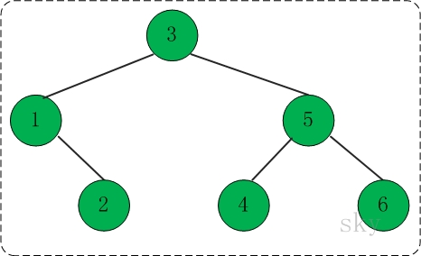
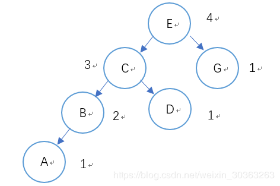
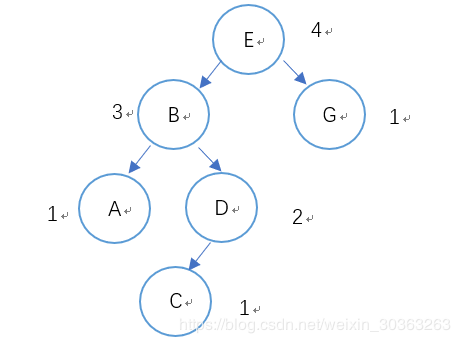
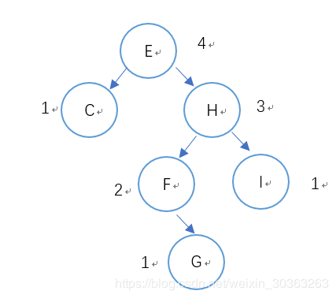
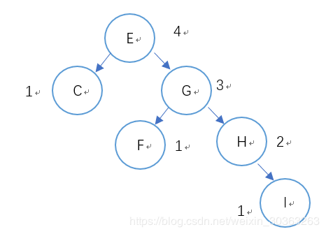
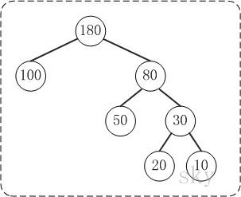
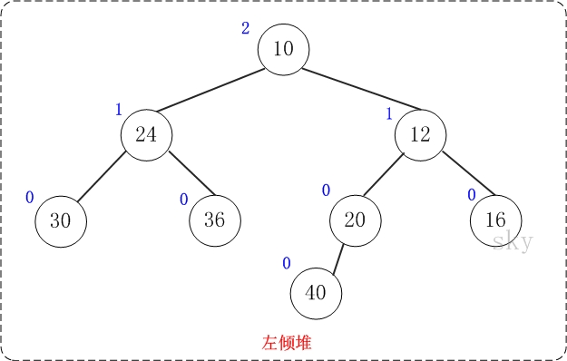
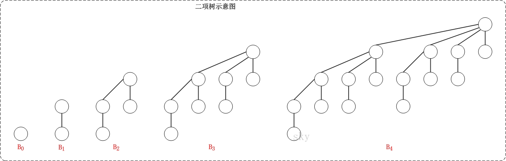

# 算法

[数据结构与算法系列](https://www.cnblogs.com/skywang12345/p/3603935.html)

## 时间复杂度和空间复杂度

算法是用来操作数据、解决程序问题的一组方法。对于同一个问题，使用不同的算法，也许最终得到的结果是一样的，但在过程中消耗的资源和时间却会有很大的区别。

那么我们应该如何衡量不同算法之间的优劣呢？  

只要还是从算法所占用的“时间”和“空间”两个维度去考量。  

时间维度：是指执行当前算法所消耗的时间，我们通常用“时间复杂度”来描述。  
空间维度：是指执行当前算法需要占用多少内存空间，我们通常用“空间复杂度”来描述。  
因此，评价一个算法的效率主要是看他的时间复杂度和空间复杂度情况。然而，有的时候时间和空间却又是“鱼和熊掌”，不可兼得的，那么我们就需要从中取一个平衡点。  
下面我来分别介绍一下“时间复杂度”和“空间复杂度”的计算方式。

时间复杂度  
我们想要知道一个算法的时间复杂度，很多人首先相当的方法就是把这个算法程序运行一遍，那么它所消耗的时间就自然而然知道了。  
这种方式可以吗？当然可以，不过它也有很多弊端。  
这种方式非常容易受运行环境的影响，在性能高的机器上跑出来的结果与在性能低的机器上跑的结果相差会很大。而且对测试时使用的数据规模也有很大关系。再者，并我们在写算法的时候，还没有办法完整的去运行呢。

因此，另一种更为通用的方法就出来了：“大O符号表示法”，即T(n)=O(f(n))

我们先来看个例子：

```C
for (i=1; i <= n; ++i) {
  j = i;
  j++;
}
```

通过“大O符号表示法”，这段代码的时间复杂度为：O(n)，为什么呢？  
在大O符号表示法中，时间复杂度的公式是：T(n) = O(f(n))，其中f(n)表示每行代码执行次数之和，而O表示正比例关系，这个公式的全称是：算法的渐进时间复杂度。

我们继续看上面的例子，假设每行代码的执行时间都是一样的，我们用1颗粒时间来表示，那么这个例子的第一行耗时是1个颗粒时间，第三行的执行时间是n个颗粒时间，

常见的时间复杂度量级有：

* 常数阶O(1)
* 对数阶O(logN)
* 线性阶O(n)
* 线性对数阶O(nlogN)
* 平方阶O(n^2)
* 立方阶O(n^3)
* K次方阶O(n^k)
* 指数阶O(2^n)

细化时间复杂度：  

* 最好情况时间复杂度
* 最坏情况时间复杂度
* 平均情况时间复杂度
* 均摊时间复杂度

```java
public int Function(int n, int x) {
  int sum = 0;
  for (int i = 1; i <= n; ++i) {
    if (i == x) {
      break;
    }
    sum += i;
  }
  return sum;
}
```

这段代码根据x值得不同，时间复杂度也有区别：  

1. 当x > n时，次diamante的时间复杂度是O(n)。
2. 当1<=x<=n时，时间复杂度是一个我们不确定的值，取决于x的值。
3. 当x = 1时，时间复杂度是O(1)。

这段代码在不同情况下，其时间复杂度是不一样的。所以为了描述代码在不同情况下的不同时间复杂度，我们引入最好、最坏、平均时间复杂度。  

最好情况时间复杂度  
最好情况时间复杂度，表示在最理想情况下，执行这段代码的时间复杂度。  
上述实例就是当x = 1的时候，循环的第一个判断就跳出，这个时候对应的时间复杂度就是最好情况时间复杂度。

最坏情况时间复杂度  
最坏情况时间复杂度，表示在最糟糕的情况下，执行这段代码的时间复杂度。  
上述实例就是x > n的时候，我们要把整个循环执行一遍，这个时候对应的时间复杂度就是最坏情况时间复杂度。

平均情况时间复杂度  
最好和最坏情况是极端情况，发生的概率并不大。为了更有效的表示平均情况下的时间复杂度，引入另一个概念：平均情况时间复杂度。  
分析上面的实例代码，判断x在循环中出现的位置，有n+1种情况：1<=x<=n和x>x。  
我们将所有情况下代码执行的次数累加起来((1+2+3+...+n)+n)，然后再除以所有情况数量(n+1)，就可以得到需要遍历次数的平均值。

大O表示法，会省略系数、低阶、常量，所以平均情况时间复杂度是O(n)。  
但是这个平均复杂度没有考虑各自情况的发生概率，这里的n+1个情况，他们的发生概率是不一样的，所以还需要引入各自情况发生的概率再具体分析。  
x要么在1~n中，要么不在1~n中，所以他们的概率都是1/2。  
同时数据在1~n中各个位置的概率都是一样为1/n。根据概率乘法法则，x在1~n中任意位置的概率是1/2n。  
因此在前面推倒过程的基础上，我们把每种情况发生的概率考虑进去，那么平均情况时间复杂度的计算过程变为：

这就是概率论中的加权平均值，也叫做期望值，所以平均时间复杂度全称叫：加权平均时间复杂度或者期望时间复杂度。  
引入概率之后，平均复杂度变为O((3n+1)/4)，忽略系数及常量后，最终得到加权平均时间复杂度为O(n)。  

均摊情况时间复杂度  
均摊复杂度是一个更加高级的概念，它是一种特殊的情况，应用的场景也更加特殊和有限。  
对应的分析方式成为：摊还分析或平摊分析  

空间复杂度  

```C
int[] m = new int[n]
for(i=1; i<=n; ++i)
{
   j = i;
   j++;
}
```

这段代码中，第一行new了一个数组出来，这个数据占用的大小为n，这段代码的2-6行，虽然有循环，但没有再分配新的空间，因此，这段代码的空间复杂度主要看第一行即可，即O(n)  

## 九种排序算法

### 选择排序

首先在未排序的数列中找到最小(or最大)元素，然后将其存放到数列的起始位置；接着再从剩余未排序的元素中继续寻找最小(or最大)元素，然后放到已排序序列的末尾。以此类推，知道所有元素均排序完毕。  

时间复杂度：O(n^2)  稳定性：不稳定

```C
/*选择排序*/
void select_sort(int a[], int n) {
  int min;//无序区中最小元素位置
  for (int i=0; i<n; i++) {
    min = i;
    for (int j=i+1; j<n; j++) {
      if (a[j]<a[min])
          min = j;
    }
    if (min != i)
        swap(a[min], a[i]);
  }
}
```

### 冒泡排序

依次比较相邻两元素，若前一个元素大于后一个元素则交换之，直至最后一个元素即为最大；然后重新从首元素开始重复同样的操作，直至倒数第二个元素即为次大元素；依次类推。如果水中的气泡，一次将最大或最小元素气泡浮出水面。  
时间复杂度：O(N^2)  稳定性：稳定  

```C
/*冒泡排序*/
void bubble_sort(int a[], int n) {
  int flag;
  for (int i=n-1;i>0;i--) {
    flag = 0;
    //将a[0...i]中最大的数据放在末尾
    for (int j=0; j<i; j++) {
      if (a[j] > a[j+1]) {
        swap(a[j], a[j+1]);
        flag = 1;
      }
    }
    if (flag == 0) {
      break;//若没有发生交换，则说明数列已经有序。
    }
  }
}
```

### 快速排序

基本思想：选择一个基准数，通过一趟排序将要排序的数据分割成独立的两部分；其中一部分的所有数据都比另外一部分的所有数据都要小。然后，再按此方法对这两部分数据分别进行快速排序，整个排序过程可以递归进行，以此达到整个数据变成有序序列。  
流程：  

1. 从数列中挑出一个基准值。
2. 将所有比基准值小的摆放在基准前面，所有比基准值大的摆在基准的后面(相同的数可以到任一边)；在这个分区退出之后，该基准就处于数列的中间位置。
3. 递归地把“基准值前面的子数列”和“基准值后面的子数列”进行排序。

时间复杂度：O(NlogN)， 最坏情况时间复杂度O(N^2)  稳定性：不稳定

```C
/*
* l -- 数组的左边界（例如，从起始位置开始排序，则l=0）
* r -- 数组的右边界（例如，排序截至到数组默认，则r=a.length-1）
*/
void quick_sort(int a[], int l, int r) {
  if (l < r) {
    int i,j,x;
    i = l;
    j = r;
    x = a[i];
    while (i < j) {
      while (i < j && a[j] > x)
        j--;//从右边向左找第一个小于x的数
      if (i < j)
        a[i++] = a[j];
      while(i < j && a[i] < x)
        i++;//从左边向右找第一个大于x的数
      if (i < j)
        a[j--] = a[i];
    }
    a[i] = x;
    quick_sort(a, l, i-1);//递归调用
    quick_sort(a, i+1, r);
  }
}
```

### 插入排序

基本思想：把n个待排序的元素看成为一个有序表和一个无序表。开始时有序表中只包含1个元素，无序表中包含n-1个元素，排序过程中每次从无序表中取出第一个元素，将它插入到有序表中的适当位置，使之成为新的有序表，重复n-1次可完成排序过程。  

时间复杂度：O(N^2)  稳定性：稳定

```C
void insert_sort(int a[], int n) {
  for (int i=1; i < n; i++) {
    int j;
    for (j=i-1; j>=0;j--) {
      if (a[j] < a[i]) {
        break;
      }
    }
    if (j != i - 1) {
      int temp = a[i];
      int k;
      for (k=i-1;k>j;k--) {
        a[k+1] = a[k];
      }
      a[k+1] = temp;
    }
  }
}
```

### 堆排序

堆排序是指利用堆这种数据结构所涉及的一种排序算法。  
因此，学习堆排序之前，有必要了解堆！若读者不熟悉堆，建议先了解堆。  
我们知道，堆分为“最大堆”和“最小堆”。最大堆通常被用来进行“升序排序”，而最小堆通常被用来进行“降序”排序。  
鉴于最大堆和最小堆是对称关系，理解其中一种即可。  
参考：[堆排序](https://www.cnblogs.com/skywang12345/p/3602162.html)  
最大堆进行升序排序的基本思想：  

1. 初始化堆：将数列a[1...n]构造成最大堆。
2. 交换数据：将a[1]和a[n]交换，使a[n]是a[1...n]中的最大值；然后将a[1...n-1]重新调整为最大堆。接着，将a[1]和a[n-1]交换，使a[n-1]是a[1...n-1]中的最大值；然后将a[1...n-2]重新调整为最大值。依次类推，直到整个数列都是有序的。

时间复杂度：O(NlogN)  稳定性：不稳定

```C
/* 
 * (最大)堆的向下调整算法
 *
 * 注：数组实现的堆中，第N个节点的左孩子的索引值是(2N+1)，右孩子的索引是(2N+2)。
 *     其中，N为数组下标索引值，如数组中第1个数对应的N为0。
 *
 * 参数说明：
 *     a -- 待排序的数组
 *     start -- 被下调节点的起始位置(一般为0，表示从第1个开始)
 *     end   -- 截至范围(一般为数组中最后一个元素的索引)
 */
void maxheap_down(int a[], int start, int end)
{
    int c = start;            // 当前(current)节点的位置
    int l = 2*c + 1;        // 左(left)孩子的位置
    int tmp = a[c];            // 当前(current)节点的大小
    for (; l <= end; c=l,l=2*l+1)
    {
        // "l"是左孩子，"l+1"是右孩子
        if ( l < end && a[l] < a[l+1])
            l++;        // 左右两孩子中选择较大者，即m_heap[l+1]
        if (tmp >= a[l])
            break;        // 调整结束
        else            // 交换值
        {
            a[c] = a[l];
            a[l]= tmp;
        }
    }
}

/*
 * 堆排序(从小到大)
 *
 * 参数说明：
 *     a -- 待排序的数组
 *     n -- 数组的长度
 */
void heap_sort_asc(int a[], int n)
{
    int i;

    // 从(n/2-1) --> 0逐次遍历。遍历之后，得到的数组实际上是一个(最大)二叉堆。
    for (i = n / 2 - 1; i >= 0; i--)
        maxheap_down(a, i, n-1);

    // 从最后一个元素开始对序列进行调整，不断的缩小调整的范围直到第一个元素
    for (i = n - 1; i > 0; i--)
    {
        // 交换a[0]和a[i]。交换后，a[i]是a[0...i]中最大的。
        swap(a[0], a[i]);
        // 调整a[0...i-1]，使得a[0...i-1]仍然是一个最大堆。
        // 即，保证a[i-1]是a[0...i-1]中的最大值。
        maxheap_down(a, 0, i-1);
    }
}
```

### 归并排序

将两个有序数列合并成一个有序数列，我们称之为“归并”。  
归并排序就是利用归并思想对数列进行排序。根据具体的实现，归并排序包括“从上往下”和“从下往上”2种方式。

1. 从下往上的归并排序：将待排序的数列分成若干个长度为1的子数列，然后将这些数列两两合并；得到若干个长度为2的有序数列，再将这些数列两两合并；得到若干个长度为4的有序数列，再将他们两两合并；直接合并成一个数列位置。这样就得到了我们想要的排序结果。
2. 从上往下的归并排序：它与“从下往上”在排序上是反方向的。

时间复杂度：O(NlogN)  稳定性：稳定

### 希尔排序

希尔排序是插入排序的一种，它是针对插入排序的改进。该方法又称缩小增量排序。  
希尔排序实质上是一种分组插入方法。它的基本思想是：对于n个待排序的数列，取一个小于n的整数gap(gap被称为步长)将待排序元素分成若干个组子序列，所有距离为gap的倍数的记录放在同一个组中；然后，对各组内的元素进行插入排序。这一趟排序完成之后，每一个组的元素都是有序的。然后减小gap的值，并重复执行上述的分组和排序。重复这样的操作，当gap=1时，整个数列就是有序的。

时间复杂度：O(N^1.5)  最坏情况时间复杂度：O(N^2)  稳定性：不稳定

```C
void shell_sort(int a[], int n) {
  int i,j,gap;
  for (gap = n/2; gap > 0; gap /= 2) {
    for (i = 0; i < gap; i++) {
      for (j=i+gap; j< n; j+=gap) {
        if (a[j] < a[j-gap]) {
          int tmp = a[j];
          ink k = j - gap;
          while (k >= 0 && a[k] > tmp) {
            a[k+gap] = a[k];
            k-=gap;
          }
          a[k+gap] = tmp;
        }
      }
    }
  }
}
```

### 基数排序

基数排序是桶排序的扩展，它的基本思想是：将整数按位数切割成不同的数字，然后按每个位数分别比较。  
具体做法是：将所有待比较数值统一为同样的数位长度，数位较短的数前面补零。然后，从最低位开始，一次进行一次排序。这样从最低位排序一直到最高位排序完成以后，数列就变成一个有序数列。

时间复杂度：O(x*N)  稳定性：稳定

### 桶排序

桶排序的原理很简单，它是将数组分到有限数量的桶子里。  
假设待排序的数组a中共有N个整数，并且已知数组a中数据的范围[0, MAX)。在桶排序时，创建容量为MAX的桶数组r，并将桶数组元素都初始化为0；将容量为MAX的桶数组中的每一个单元都看作一个“桶”。  
在排序时，逐个遍历数组a，将数组a的值，作为“桶数组r”的下标。当a中数据被读取时，就将桶的值加1。例如，读取到数组a[3]=5，则将r[5]的值+1。

时间复杂度：O(x*N)  稳定性：稳定

### 排序算法比较


## 七大查找算法

### 顺序查找

说明：顺序查找适合于存储结构为顺序存储或连接存储的线性表。  
基本思想：顺序查找也称为线性查找，属于无序查找算法。从数据结构线性表的一端开始，顺序扫描，依次将扫描到的节点关键字与给定值k相比较，若相等则表示查找成功；若扫描结束仍没有找到关键字等于k的节点，表示查找失败。  
复杂度分析：  
查找成功时的平均查找长度为(n+1)/2;  
当查找不成功时，需要n+1次比较，时间复杂度为O(n)。  
所以，顺序查找的时间复杂度为O(n)。

### 二分查找

说明：元素必须是有序的，如果是无序的则要先进行排序操作。  
基本思想：也成为是折半查找，属于有序查找算法。用给定值k先与中间节点的关键字比较，中间节点把线性表分成两个子表，若相等则查找成功；若不相等，再根据k与该中间节点关键字的比较结果确定下一步查找哪个子表，这样递归进行，直到查找到或查找结束发现表中没有这样的节点。  
复杂度分析：最坏情况下，关键词比较次数为log(n+1)，且期望时间复杂度为O(logn)。  
注：折半查找的前提条件时需要有序表顺序存储，对于静态查找表，一次排序后不再变化，折半查找能得到不错的效率。但对于需要频繁执行插入或删除操作的数据集来说，维护有序的排序会带来不小的工作量，那就不建议使用。

### 插值查找

在介绍插值查找之前，首先考虑一个新问题，为什么上述算法一定要是折半，而不是折四分之一或者折更多呢？  
打个比方，在英语字典里面查找”apple“，你下意识翻开字典是翻前面的书页还是后面的书页呢？如果再让你查找"zoo"，你又怎么查？很显然，这里你绝对不会是从中间开始查起，而是有一定目的的往前或往后翻。  
同样的，比如要在取值范围1~10000之间100个元素从小到大均匀分布的数组中查找5，我们自然会考虑从数组下标较小的开始查找。  
经过以上分析，折半查找这种查找方式，不是自适应的(也就是说是傻瓜式的)。二分查找中查找点计算如下：  
mid=(low+high)/2，即mid=low+1/2x(high-low);  
通过类比，我们可以将查找的点改进为如下：  
mid=low+(key-a[low])/(a[high]-a[low])x(high-low),  
也就是将上述的比例参数1/2改进为自适应的，根据关键字在整个有序表中所处的位置，让mid值得变化更靠近关键字key，这样也就间接地减少了比较次数。  
基本思想：基于二分查找算法，将查找点的选择改进为自适应选择，可以提高查找效率。当然，插值查找也属于有序查找。  
注：对于表比较大，而关键字分布又比较均匀的查找表来说，插值查找算法的平均性能比折半查找要好的多。反之，数组中如果分布非常不均匀，那么插值查找未必是很适合的选择。  
复杂度分析：查找成功或者失败的时间复杂度均为O(log(logn))。

### 斐波拉契查找

在介绍斐波拉契算法之前，我们先介绍一下和它紧密相连并且大家都熟知的一个概念---黄金分割。  
黄金比例又称为黄金分割，是指事物各部分间一定的数学比例关系，即将整体一分为二，较大部分与较小部分之比等于整体与较大部分之比，其比值约为1：0.618或1.618：1。  
0.618被公认为最具有审美意义的比例数字，这个数值的作用不仅仅体现在诸如绘画、雕塑、音乐、建筑等艺术领域，而且在管理、工程设计等方面也有着不可忽视的作用。因此被称为黄金分割。  
大家记不记得斐波拉契数列：1，1，2，3，5，8，13，21，34，55，89....  
然后我们会发现，随着斐波拉契数列的递增，前后两个数的比值会越来越接近0.618，利用这个特性，我们就可以将黄金比例运用到查找技术中。  
基本思想：也是二叉查找的一种提升算法，通过运用黄金比例的概念在数列中选择查找点进行查找，提高查找效率。同样地，斐波拉契查找也属于一种有序查找算法。  
复杂度分析：最坏情况下，时间复杂度为O(logn)，且其期望复杂度也为O(logn)。

### 树表查找

最简单的树表查找算法--二叉树查找算法。  
基本思想：二叉查找树是先对待查找的数据进行生成树，确保树的左分支的值小于右分支的值，然后在就行和每个节点的父节点比较大小，查找最适合的范围。这个算法的查找效率很高，但是如果使用这种查找方法要首先创建树。  
二叉查找树性质：对二叉查找树进行中序遍历，即可得到 有序的数列。

### 分块查找

分块查找又称索引顺序查找，它是顺序查找的一种改进方法。  
算法思想：将n个数据元素“按块有序”划分为m块(m <= n)。每一块中的节点不必有序，但块与块之间必须“按块有序”；即第1块中任一元素的关键字都必须小于第2块中任一元素的关键字；而第2块中的任一元素又都必须小于第3块中任一元素。。。。

### 哈希查找

什么是哈希表？  
我们使用一个下标范围比较大的数组来存储元素。可以设计一个函数(哈希函数，也叫做散列函数)，使得每个元素的关键字都与一个函数值(即数组下标)相对应，于是用这个数组单元来存储这个元素；也可以简单的理解为：按照关键字为每一个元素“分类”，然后将这个元素存储在相应“类”所对应的地方。但是，不能够保证每个元素的关键字与函数值一一对应的，因此极有可能出现对于不同的元素，却计算出了相同的函数值，这样就产生了“冲突”，换句话说，就是把不同的元素分在了相同的“类”之中。后面我们将看到一种解决“冲突”简便做法。  
总得来说，“直接定址”与“解决冲突”是哈希表的两大特点。  
什么是哈希函数？  
哈希函数的规则是：通过某种转换关系，使关键字适度的分散到指定大小的顺序结构中，越分散，则以后查找的时间复杂度越小，空间复杂度越高。  
算法思想：哈希的思路很简单，如果所有的键都是整数，那么就可以使用一个简单的无序数组来实现：将键作为索引，值即为其对应的值，这样就可以快速访问任意键的值。

复杂度分析：对于无冲突的hash表而言，查找复杂度为O(1)。

哈希函数有五种实现方式：  

1. 直接定址法：取关键字的线性函数值作为哈希地址。  
2. 数字分析法：取关键字中的若干位作为哈希地址。
3. 平方取中法：取关键字平方后的中间即为作为哈希地址。
4. 折叠法：将关键字分割成位数相同的几部分，然后取这几部分的叠加和作为哈希地址。
5. 除留余数法：H(key) = key MOD p ，p<=m ，m为不大于哈希表的数。

上述五种实现方式中最常用的是除留余数法，而通过哈希函数寻址的过程可能出现“冲突”，解决哈希冲突的方法：

1. 开放定址法(线性探测，二次探测，伪随机探测)
2. 链地址法
3. 再散列(双重散列，多重散列)  
当发生冲突时，使用第二个、第三个、哈希函数计算地址，直到无冲突。缺点：计算时间增加。
4. 建立一个公共溢出区

## 线性结构

### 数组、单链表和双链表

数组：  
数组有上界和下界，数组的元素在上下界内是连续的。  
数组的特点是：数据是连续的；随机访问速度快。

单向链表：  
单向链表是链表的一种，它由节点组成，每个节点都包含下一个节点的指针。  

双向链表：  
双向链表是链表的一种。和单链表一样，双链表也是由节点组成，它的每个数据节点中都有两个指针，分别指向直接后继和直接前驱。所以，从双向链表中的任意一个节点开始，都可以很方便地访问它的前驱结点和后继结点。一般我们都构造双向循环链表。

### Linux内核中双向链表的经典实现

### 栈

这里所说的栈是数据结构中的栈，而不是内存模型中的栈。  
栈(stack)，是一种线性存储结构，它有以下几个特点：  

1. 栈中数据是按照“后进先出(LIFO)”方式进出栈的。
2. 向栈中添加/删除数据时，只能从栈顶进行操作。

栈通常包括的三种操作：push、peek、pop。  
push -- 向栈中添加元素。  
peek -- 返回栈顶元素。  
pop -- 返回并删除栈顶元素的操作。  

栈的C实现：  

1. 数组实现的栈，并且只能存储int数据。  
2. 单向链表实现的栈，并且只能存储int数据。
3. 双向链表实现的栈，并且只能存储int数据。
4. 双向链表实现的栈，能存储任意类型的数据。

### 队列

队列，是一种线性存储结构。它有以下几个特点：  

1. 队列中的数据是按照“先进先出(FIFO)”方式进出队列的。  
2. 队列只允许在“队首”进行删除操作，而在“队尾”进行插入操作。  

队列通常包括的两种操作：入队列和出队列。

队列的C实现：  

1. 数组实现的队列，并且只能存储int数据。  
2. 单向链表实现的队列，并且只能存储int数据。
3. 双向链表实现的队列，并且只能存储int数据。
4. 双向链表实现的队列，能存储任意类型的数据。

## 树形结构

### 树的介绍

1.树的定义  
树是一种数据数据结构，它是由n(n>=1)个有限节点组成一个具有层次关系的集合。

把它叫做“树”是应为它看起来就像可以倒挂的树，也就是说它是根朝上，而叶朝下的，它具有以下的特点：  

1. 每个节点有零个或多个子节点  
2. 没有父节点的节点称为根节点
3. 每个非根节点有且只有一个父节点
4. 除了根节点外，每个子节点可以分为多个不相交的子树

2.基本术语  
若一个节点有子树，那么该节点称为子树根的“双亲”，子树的根是该节点的“孩子”。有相同双亲的节点互为“兄弟”。一个节点的所有子树上的任何节点都是该节点的后裔。从根节点到某个节点的路径上的所有节点都是该节点的祖先。  
节点的度：节点拥有的子树的数目  
叶子：度为零的节点  
分支节点：度不为零的节点  
树的度：树中节点的最大度  
层次：根节点的层次为1，其余节点的层次等于该节点的双亲节点的层次加1  
树的高度：树中节点的最大层次  
无序树：如果树中节点的各个子树之间的次序是不重要的，可以交换位置  
有序树：如果树中节点的各个子树之间的次序是重要的，不可以交换位置  
森林：0个或多个不相交的树组成。对森林加上一个根，森林即成为树；删去根，树即成为森林。

### 二叉查找树

二叉树定义  
二叉树是每个节点最多有两个子树的树结构。它有五种基本形态：二叉树可以是空集；根可以有空的左子树或右子树；或者左、右子树皆为空。  
二叉树的性质  
二叉树有以下几种性质：TODO(上标和下标)

1. 二叉树第i层上的节点数目最多为2^{i-1}(i>=1)。
2. 深度为k的二叉树至多有2^{k}-1个节点(k>=1)。
3. 包含n个节点的二叉树的高度至少为log<sub>2</sub>(n+1)
4. 在任意一颗二叉树中，若终端节点的个数为n<sub>0</sub>，度为2的节点数为n<sub>2</sub>，则n<sub>0</sub>=n<sub>2</sub>+1

满二叉树  
高度为h，并且有2^{h}-1个节点的二叉树，被称为满二叉树  
完全二叉树  
定义：一颗二叉树中，只有最下面两层节点的度可以小于2，并且最下层的叶节点集中在靠左的若干位置上。这样的二叉树称为完全二叉树。  
二叉查找树  
二叉查找树，又被称为二叉搜索树。设x为二叉查找树中的一个节点，x节点包含关键字key，节点x的key值记为key[x]，如果y是x的左子树中的一个节点，则key[y] <= key[x]；如果y是x的右子树的一个节点，则key[y]>=key[x]。

在二叉查找树中：  

1. 若任意节点的左子树不空，则左子树上所有节点的值均小于它的根节点的值；
2. 任意节点的右子树不空，则右子树上所有节点的值均大于它的根节点的值；
3. 任意节点的左、右子树也分别为二叉查找树。
4. 没有键值相等的节点。

在实际应用中，二叉查找树的使用比较多。下面，用C语言实现二叉查找树。

```C
typedef int Type;

typedef struct BSTreeNode {
  Type key;     //关键字(键值)
  struct BSTreeNode *left;  //左孩子
  struct BSTreeNode *right;  //右孩子
  struct BSTreeNode *parent;  //父节点
}Node, *BSTree;
```

遍历  

1. 前序遍历
2. 中序遍历
3. 后续遍历

前序遍历  
若二叉树非空，则执行以下操作：  

1. 访问根节点；
2. 先序遍历左子树；
3. 先序遍历右子树。

中序遍历  
若二叉树非空，则执行以下操作：  

1. 中序遍历左子树；
2. 访问根节点；
3. 中序遍历右子树。

后序遍历  
若二叉树非空，则执行以下操作：

1. 后续遍历左子树
2. 后续遍历右子树
3. 访问根节点


对于上面的二叉树而言，

1. 前序遍历结果：3 1 2 5 4 6
2. 中序遍历结果：1 2 3 4 5 6
3. 后续遍历结果：2 1 4 6 5 3

前驱和后继  
节点的前驱：是该节点的左子树中最大节点  
节点的后继：是该节点的右子树中最小节点

### AVL树

AVL树是根据它的发明者来命名的。  
它是最先发明的自平衡二叉查找树，也被称为高度平衡树。相比于“二叉查找树”，它的特点是：AVL树中任何节点的两个子树的高度最大差别为1。  

AVL树的查找、插入和删除的平均和最坏情况下都是O(logn)。
如果在AVL树中插入或删除节点后，使得高度之差大于1。此时，AVL树的平衡状态就被破坏，它就不再是一颗AVL树。为了让它重新维持在一个平衡状态，就需要对其进行旋转处理。学AVL树，重点的地方就是它的旋转算法。

定义

```C
typedef int Type;
typedef struct AVLTreeNode {
  Type key;  //关键字(键值)
  int height;
  struct AVLTreeNode *left;  //左孩子
  struct AVLTreeNode *right;  、、右孩子
}Node, *AVLTree;
```

旋转  
前面说过，如果在AVL树中进行插入或删除节点后，可能导致AVL树失去平衡。这种失去平衡的可以概括为4中姿态：LL(左左)、LR(左右)、RR(右右)、RL(右左)，定义如下：  

1. LL：LeftLeft，也称为“左左”。插入或删除一个节点后，根节点的左子树的左子树还有非空节点，导致“根的左子树的高度”比“根的右子树的高度”大于2，导致AVL树失去了平衡。  
解读：LL插入方式，插入的节点在Z节点的左子树的左子树上，如下图，“A”节点插入影响“C”节点的平衡，“C”的父节点为“E”，插入节点“A”在“E”节点(E节点为失去平衡的节点)的左子树的左子树上。即“B”节点的左右子节点都算LL插入。  

2. LR：LeftRight，也称为“左右”。插入或删除一个节点后，根节点的左子树的右子树还有非空子节点，导致“根的左子树的高度”比“根的右子树的高度”大2，导致AVL树失去了平衡。  
解读：LR插入方式，插入的节点在Z节点的左子树的右子树上，如下图，“C”节点插入影响“B”节点的平衡，“B”的父节点为“E”，插入节点“C”在“E”节点的左子树的右子树上。即“D”节点的左右子节点都算LR插入。  

3. RL：RightLeft，称为“右左”。插入或删除一个节点后，根节点的右子树的左子树还有非空子节点，导致“根的右子树的高度”比“根的左子树的高度”大2，导致AVL树失去了平衡。  
解读：RL插入方式，插入的节点在Z节点的右子树的左子树上，如下图，“G”节点插入影响“H”节点的平衡，“H”的父节点为“E”，插入节点“G”在“E”节点的右子树的左子树上。即“F”节点的左右子节点都算RL插入。  

4. RR：RightRight，称为“右右”。插入或删除一个节点后，根节点的右子树的右子树还有非空子节点，导致“根的右子树的高度”比“根的左子树的高度”大2，导致AVL树失去了平衡。  
解读：RR插入方式，插入的节点在Z节点的右子树的右子树上，如下图，“I”节点插入影响“G”节点的平衡，“G”的父节点为“E”，插入节点“I”在“E”节点的右子树的右子树上。即“H”节点的左右子节点都算RR插入。  


### 伸展树

伸展树是一种二叉排序树，它能在O(log n)内完成插入、查找和删除操作。  

1. 伸展树食欲二叉查找树，即它具有和二叉查找树一样的性质：假设x为树中的任意一个节点，x节点包含关键字key，节点x的key值为key[x]。如果y是x的左子树中的一个节点，则key[y] <= key[x]，如果y是x的右子树的一个节点，则key[y] >= key[x]。
2. 除了拥有二叉查找树的性质之外，伸展树还具有一个特点是：当某个节点被访问时，伸展树会通过旋转使该节点称为树根。这样做的好处是，下次要访问该节点时，能够迅速的访问到该节点。

假设想要对一个二叉查找树执行一系列查找操作。为了使整个查找时间更小，被查询频率高的那些条目就应当经常处于靠近树根的位置。于是想到设计一个简单方法，在每次查找之后对树进行重构，把被查找的条目搬移到离树近一些的地方。伸展树应运而生，它是一种自调整形式的二叉查找树，它会沿着从某个节点到树根之间的路径，通过一系列的旋转把这个节点搬移到树根去。

### 红黑树

R-B Tree，全称是Red-Black Tree，又称为“红黑树”，它是一种特殊的二叉查找树。红黑树的每个节点上都有存储位表示节点的颜色，可以是红或者黑。

红黑树的特性：  

1. 每个节点或者是黑色，或者是红色。
2. 根节点是黑色。
3. 每个叶子节点(NIL)是黑色。【注意：这里叶子节点，是指为空(NIL或NULL)的叶子节点】。
4. 如果一个节点是红色的，则它的子节点必须是黑色的。
5. 从一个节点到该节点的子孙节点的所有路径上包含相同数目的黑节点。


红黑树的应用比较广泛，主要是用它来存储有序的数据，它的时间复杂度O(lgn)，效率非常之高。

红黑树的基本操作是添加、删除。在对红黑树进行添加或删除之后，都会用到旋转方法。为什么呢？道理很简单，添加或删除红黑树中的节点之后，红黑树就发生了变化，可能不满足红黑树的5条性质，也就不再是一颗红黑树了，而是一颗普通的树。而通过旋转，可以使这颗树重新成为红黑树。简单点说，旋转的目的是让树保持红黑树的特性。

旋转包括两种：左旋和右旋。

### 哈夫曼树

哈弗曼树，它是最优二叉树。

定义：给定n个权值作为n个叶子节点，构造一颗二叉树，若树的带权路径长度达到最小，则这可树被称为哈弗曼树。这个定义里面涉及到了几个陌生的概念，下面就是一颗哈弗曼树，我们来看图解答。



1. 路径和路径长度  
定义：在一颗树中，从一个节点往下可以达到的孩子或孙子节点之间的通路，称为路径。通路中分支的数目称为路径长度。若规定根节点层数为1，则从根节点到L层节点的路径长度为L-1。  
例子：100和80的路径长度是1，50和30的路径长度是2，20和10的路径长度是3。

2. 节点的权及带权路径长度  
定义：若将树中的节点赋给一个有着某种含义的数值，则这个数值称为该节点的权。节点的带权路径长度为：从根节点到该节点之间的路径长度与该节点的权的乘积。  
例子：节点20的路径长度是3，它的带权路径长度=路径长度 x 权 = 3 x 20 = 60。

3. 树的带权路径长度  
定义：树的带权路径长度规定为所有叶子节点的带全路径长度之和，记为WPL。  
例子：示例中，树的WPL = 1 x 100 + 2 x 80 + 3 x 20 + 3 x 10 = 350

## 堆

堆的定义  
堆，这里所说的堆是数据结构中的堆，而不是内存模型中的堆。堆通常是一个可以被看作一棵树，它满足下列性质：  
性质一：堆中任意节点的值总是不大于(不小于)其子节点的值。
性质二：堆总是一颗完全树。  
将任意节点不大于其子节点的堆叫做最小堆或小根堆，而将任意节点不小于其子节点的堆叫做最大堆或大根堆。常见的堆有二叉堆、左倾堆、二项堆、斐波拉契堆等等。

### 二叉堆

二叉堆是完全二元树或者是近似完全二元树，它分为两种：最大堆和最小堆。  
最大堆：父节点的值总是大于或等于任何一个子节点的键值；最小堆：父节点的键值总是小于或等于任何一个子节点的键值。示意图如下：  
  
二叉堆一般都通过“数组”来实现。数组实现的二叉堆，父节点和子节点的位置存在一定的关系。有时候，我们将“二叉堆的第一个元素”放在数组索引0的位置，有时候放在1的位置。当然，它们的本质一样（都是二叉堆），只是实现上稍微有一丁点区别。  

### 左倾堆

左倾堆，又被称为左偏树、左偏堆，最左堆等。  
它和二叉堆一样，都是优先队列中涉及到”对两个优先队列进行合并“的问题时，二叉堆的效率就无法令人满意了。

定义：  
左倾堆是一颗二叉树，它的二节点除了和二叉树的节点一样具有左右子树之外，还有两个属性：键值和零距离。

1. 键值的作用是来比较节点的大小，从而对节点进行排序。
2. 零距离（英文名NPL，即Null Path Length）则是从一个节点到一个”最近的不满节点“的路径长度。不满节点是指该节点的左右孩子至少有一个为NULL。叶节点的NPL为0，NULL节点的NPL为-1。

  
性质一：节点的键值小于或等于它的左右子节点的键值。  
性质二：节点的左孩子的NPL >= 右孩子的NPL。  
性质三：节点的NPL = 它的右孩子的NPL + 1。

左倾堆，顾名思义，是有点向左倾斜的意思了。它在统计问题、最值问题、模拟问题和贪心问题等问题中有着广泛的应用。此外，斜堆是比左倾堆更为一般的数据结构。  
前面说过，它能很好的解决”两个优先队列合并“的问题。实际上，左倾堆的合并操作的平摊时间复杂度为O(lgn)，而完全二叉堆为O(n)。合并就是左倾树的重点，插入和删除操作都是以合并操作作为基础的。插入操作，可以看做两颗左倾树合并；删除操作（移除优先队列中对首元素），则是移除根节点之后再合并剩余的两个左倾树。

### 斜堆

斜堆也叫自适应堆，它是左倾堆的一个变种。和左倾堆一样，它通常用于实现优先队列。它的合并操作的时间复杂度也是O(lgn)。  
相比于左倾堆，斜堆的节点没有”零距离“这个属性。除此之外，他们斜堆的合并操作也不同。斜堆的合并操作算法如下：  

1. 如果一个空斜堆与一个非空斜堆合并，返回非空斜堆。
2. 如果两个斜堆都非空，那么比较两个根节点，取较小堆的根节点为新的根节点。将”较小堆的根节点的右孩子“和”较大堆“进行合并。
3. 合并后，交换新堆根节点的左孩子和右孩子。

第三步是斜堆和左倾堆合并操作差别的关键所在，如果是左倾堆，则合并后要比较左右孩子的零距离大小，若右孩子的零距离 > 左孩子的零距离，则交换左右孩子；最后，在设置根的零距离。

### 二项堆

定义：二项堆是二项树的集合。在了解二项堆之前，先对二项树进行介绍。

二项树是一种递归定义的有序树。它的递归定义如下：  

1. 二项树B<sub>0</sub>只有一个节点；
2. 二项树B<sub>k</sub>由两颗二项树B<sub>(k-1)</sub>组成，其中一棵树是另一颗树根的最左孩子。

如图所示：  


### 斐波那契堆

斐波拉契堆是堆中一种，它和二项堆一样，也是一种可合并堆；可用于实现合并优先队列。斐波拉契堆比二项堆具有更好的平摊分析性能，它的合并操作的时间复杂度是O(1)。  
与二项堆一样，它也是由一组堆最小有序树组成，并且是一种可合并堆。  
与二项堆不同的是，斐波拉契堆中的树不一定是二项树；而且二项堆中的树是有序排列的，但是斐波拉契堆中的树都是有根而无序的。


## 图

### 邻接矩阵无向图

### 邻接表无向图

### 邻接矩阵有向图

### 邻接表有向图

### 深度优先搜索和广度优先搜索

### 拓扑排序

### Kruskal算法

### Prim算法

### Dijkstra算法

## B-Tree

## R-Tree

## bitmap index

## 字符串反转

## 链表反转

## 有序数组合并

## 查找两个子视图的共同父视图

## 求无序数组当中的中位数
