# 网络

## HTTP原理

超文本传输协议

### 请求/响应报文

请求报文格式

响应报文格式

### 请求方式

GET/POST/HEAD/PUT/DELETE/OPTIONS

### GET和POST区别

GET：获取资源  
安全的、幂等的、可缓存的
POST：处理资源
非安全的、非幂等的、不可缓存的

安全性：不应该引起Server端的任何状态变化，如GET、HEAD、OPTIONS
幂等性：同一个请求方法执行多次和执行一次的效果完全相同，如PUT、DELETE  
可缓存性：请求是否可以被缓存。  GET、HEAD

* 连接建立流程
* HTTP的特点

### HTTP2与HTTP1.1的区别

1.HTTP2使用的是二进制传送，HTTP1.X是文本（字符串）传送。

大家都知道HTTP1.X使用的是明文的文本传送，而HTTP2使用的是二进制传送，二进制传送的单位是帧和流。帧组成了流，同时流还有流ID标示，通过流ID就牵扯出了第二个区别

2.HTTP2支持多路复用

因为有流ID，所以通过同一个http请求实现多个http请求传输变成了可能，可以通过流ID来标示究竟是哪个流从而定位到是哪个http请求

3.HTTP2头部压缩

HTTP2通过gzip和compress压缩头部然后再发送，同时客户端和服务器端同时维护一张头信息表，所有字段都记录在这张表中，这样后面每次传输只需要传输表里面的索引Id就行，通过索引ID就可以知道表头的值了

4.HTTP2支持服务器推送

### 状态消息

1xx:信息
消息 | 描述
- | - |
100 Continue | 服务器仅接收到部分请求，但是一旦服务器并没有拒绝该请求，客户端应该继续发送其余的请求。
101 Switching Protocols | 服务器转换协议：服务器将遵从客户的请求转换到另外一种协议。
2xx:成功
消息 | 描述
- | - |
200 OK | 请求成功
201 Created | 请求被创建完成，同时新的资源被创建。
3xx:重定向
消息 | 描述
- | - |
301 Moved Permanently | 所请求的页面已经转移至新的url。永久重定向
302 Found | 所请求的页面已经临时转移至新的url。临时重定向
303 See Other | 所请求的页面可在别的url下被找到。
304 Not Modified | 资源未修改
4xx:客户端错误
消息 | 描述
- | - |
400 Bad Request | 服务器未能理解请求。
401 Unauthorized | 被请求的页面需要用户名和密码。
403 Forbidden | 对被请求页面的访问被禁止。
404 Not Found | 服务器无法找到被请求的页面。
5xx:服务器错误
消息 | 描述
- | - |
500 Internal Server Error | 请求未完成。服务器遇到不可预知的情况。
501 Not Implemented | 请求未完成。服务器不支持所请求的功能。
502 Bad Gateway | 请求未完成。服务器从上游服务器收到一个无效的响应。
503 Service Unavailable | 请求未完成。服务器临时过载或当机。
504 Gateway Timeout | 网关超时。

### 连接建立流程  

### HTTP的特点

* 无连接，每次请求完成之后连接都断开了，基于此，我们如何实现HTTP的持久连接呢？
* 无状态，两次请求服务器是不知道是不是同一个用户的，基于此我们如何保存用户的状态呢？Cookie/Session

#### 持久连接

所涉及的头部字段  
Connection: keep-alive  //持久连接  
time: 20  //20秒后关闭  
max: 10  //最多可以发送10个请求  

怎样判断持久连接中一个请求是否结束的？  

1. 通过响应报文中的Content-length来判断所接收的数据是否接收完成来判断请求结束。
2. 多次响应中头部有chunked，当有多个块通过http的tcp连接传输给客户端的时候，每个报文都有chunked字段，最后一个会有空的chunked，通过chunked为空来判断请求是否结束。

Charles抓包原理是怎样的？  
是通过http的中间人攻击这种漏洞来进行实现的。  

中间人攻击的定义：  
中间人攻击是指攻击者与通讯的两端分别创建独立的联系，并交换其所收到的数据，使通讯的两端认为他们正在通过一个私密的连接与对方直接对话，但事实上整个会话都被攻击者完全控制。

#### 保存状态

所谓cookie是为了辨别用户身份、进行session跟踪而储存在用户本地终端上的数据  
Cookie是服务器返回，客户端存在内存的，可以使用`[[NSHTTPCookieStorage sharedHTTPCookieStorage] setCookie:userCookie]`保存，但是会因为过期下次启动可能就失效了，所以最好使用NSUserDefault保存。  

### HTTPS和HTTP有怎样的区别

HTTPS = HTTP + SSL/TLS

HTTPS连接建立流程是怎样的？  

1. 首先客户端向服务器发送自己的TLS版本号、支持的加密算法、随机数C
2. 服务器拿到随机数后用私钥进行加密把加密后的随机数S返回给客户端，并同时给客户端返回一个数字证书，以及商定的加密算法
3. 客户端拿到数字证书后验证其合法性
4. 客户端拿到随机数后用公钥进行解密，并和之前的随机数进行对比
5. 客户端通过加密算法生成预主密钥，并和前两个随机数一起组装成会话秘钥保存
6. 客户端将预主密钥通过公钥加密发送给服务器
7. 服务器收到预主密码用私钥解密之后，和之前的两个随机数一起组装成会话秘钥保存
8. 客户端发送加密的握手消息
9. 服务端返回一个加密的握手消息来验证安全通道是否已经建立完成。

### 如何防止HTTPS抓包

HTTPS抓包主要是中间人安装了一个根证书，当你安装该根证书之后，该证书机构颁发的其他证书默认都会被你的系统信任，这是HTTPS抓包的重要前提！！  
那么客户端怎么防止被抓包呢？有两种方式：  

1. 可以在进行网络请求的时候，客户端判断当前是否设置了代理，如果设置了代理，不允许进行访问。  
2. 客户端本地做证书校验，并不只是校验公钥。

## TCP与UDP

### UDP

特点：无连接、尽最大努力交付、面向报文(既不合并，也不拆分)  
功能：复用、分用、差错检测  
复用：  
多个用户使用一个IO资源发送消息时，我们称之为复用
分用：  
多个用户使用一个IO资源接收消息时，我们称之为分用，而UDP的复用是通过端口号来实现复用和分用的。  

在网络层，局域网内多个主机利用一个路由网关发送消息给互联网的其他主机，这也是复用技术。同理，利用网关接收路由数据包就叫分用技术。  

在传输层，操作系统的多个进程(这里一个端口表示一个进程)利用传输层协议(或称为传输层接口)发送数据称为复用，同理接收时叫做分用。

在应用层，操作系统的多个线程利用一个端口(或者叫socket,socket=IP+端口号)发送消息称为复用，同理接收时叫分用  

差错检测：  
以16位字为一个单元，按二进制反码计算出这些16位字的和，将和的二进制反码写入到检验和位

### TCP

特点：面向连接、可靠传输、面向字节流、流量控制、拥塞控制  
面向连接：  
数据传输开始之前，需要建立连接，三次握手
数据传输结束之后，需要释放连接，四次挥手
可靠传输：  
无差错、不丢失、不重复、按序到达  
可靠传输通过停止等待协议实现，有四种情况：  

* 无差错情况  
* 超时重传  
客户端向服务端发送消息时，如果消息丢失，那么会在一定时间后重新发送
* 确认丢失  
服务端收到消息后，向客户端发送一个确认，如果这个确认丢失，那么客户端也会在一定时间后重新发送，服务端在收到消息后，会将第二次发送的消息丢弃，同时返回给客户端一个确认。
* 确认迟到  
服务端收到消息后，向客户端发送一个确认，但是由于网络原因，客户端一直未收到服务端的确认，那么客户端在一定时间后会重新向服务端发送消息，服务端收到消息后对重新发送的消息不做处理，同时给客户端发送一个新的确认，客户端收到新的确认后，再进行下一次发送，如果客户端在某个时刻收到了迟到的确认，什么也不做。

面向字节流：  
当发送方进行数据发送时，在TCP层会有个发送缓冲区，在接收方也有个接收缓冲区。  
**流量控制**：  
我们知道TCP Hheader中有一个Window Size字段，它其实是指接收端的窗口，即接收窗口，用来告知发送端自己所能接收的数据量，从而达到一部分流量控制的目的。假设有10M数据，这10MB数据是在某些机制的控制下进行传输的，其中一种重要机制就是窗口机制。发送端的发送窗口是基于接收端的接收窗口来计算的，我们可以把这10M数据进行分类：
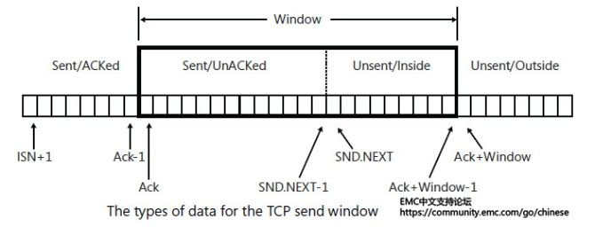

1. 已发送且已应答(Sent/Acked)
2. 已发送但尚未应答(Send/unAcked)
3. 未发送，但位于当前发送窗口之内(Unsent/Inside)
4. 未发送，但位于当前发送窗口之外(Unsent/Outside)

已发送且已应答(**Sent/Acked**)  
Sent/Acked数据的第一个字节是ISN+1，ISN是指在TCP建立连接时由SYN分段所选择的第一个编号。SYN Flag被当做是一个字节的数据，特地会被应答一次。因此，TCP连接上发送的数据的第一个字节编号就是ISN+1，被应答的数据的最后一个字节编号为『ACK编号-1』。例如，A发送1000个字节给B，假设ISN=1，则所要发送数据的第一个字节的编号为2，全部发送到B之后，B会应答1002，意思是说前1001（包括ISN）个字节我都收到了，请给我第1002个字节。所以，被应答的数据的最后一个字节编号为1001。

已发送但尚未应答(**Send/unAcked**)  
Send/unAcked数据的状态可能是正在传输的过程中，或是被网络丢弃了，或是已达到接收端但应答尚未被发送(因为Delayed-Ack)，又或是应答正在传输过程中。

为了区分Send/unAcked数据和Unsent/Inside数据，TCP维护一个叫做SND.NEXT的变量，它是下一个即将被发送的字节编号。所以SND.NEXT的值将是下一个即将被发送的TCP分段的Sequence Number字段的值。Send/UnAcked数据的第一个字节是接收端上一次接受的应答分段的Acknowledge Number字段的值。

未发送，但位于当前发送窗口之内(**Unsent/Inside**)  
Unsent/Inside数据是接收端允许发送端发送的数据，发送端可以发送窗口内的所有数据，无需等待应答以及窗口更新。换句话说，如果发送端停止发送并等待应答，那就说明已经没有Unsent/Inside的数据了。

然而，如果遇到拥塞，发送端的流量控制机制，即slow start和congestion avoidance会阻止发送端发送所有位于接收窗口内的数据。在这种情况下，这些机制会主宰等待应答之前的可发送数据量。

未发送，但位于当前发送窗口之外(**Unsent/Outside**)  
Unsent/OutSide数据是位于当前发送窗口以外的数据，代表将来要发送的数据，但根据目前的接收窗口他们是不允许被发送的。接收端会丢弃无法保存在接收缓冲区中的数据，并用当前的应答编号来应答发送端。

只有当前一个ACK被发送端收到之后，后一个ACK才能够发送出去，这样就保证了滑动窗口的一个顺序。

**拥塞控制**：  
发生拥塞控制的原因：资源（比如说带宽、交换节点的缓存、处理机）的需求 > 可用资源。  
作用：拥塞控制就是为了防止过多的数据注入到网络中，这样可以使网络中的路由器或者链路不至于过载。拥塞控制要做的都有一个前提：就是网络能够承受现有的网络负荷。

对比流量控制：拥塞控制是一个全局的过程，涉及到所有的主机、路由器以及降低网络相关的所有因素。流量控制往往指点对点通信量的控制。是端对端的问题。

* 慢开始、拥塞避免  
发送的最初执行满开始，令拥塞窗口cwnd=1，发送方只能发送1个报文段；当收到确认后，将cwnd加倍，因此之后发送方能够发送的报文段数量为：2、4、8...  
注意到满开始每次轮次都将cwnd加倍，这样会让cwnd增长速度非常快，从而使得发送方发送的速度增长速度过快，网络拥塞的可能性也就更高。设置一个满开始门限ssthresh，当cwnd >= ssthresh时，进入拥塞避免，每次轮次只将cwnd+1。  
如果出现了超时，则令ssthresh = cwnd/2，然后重新执行满开始。
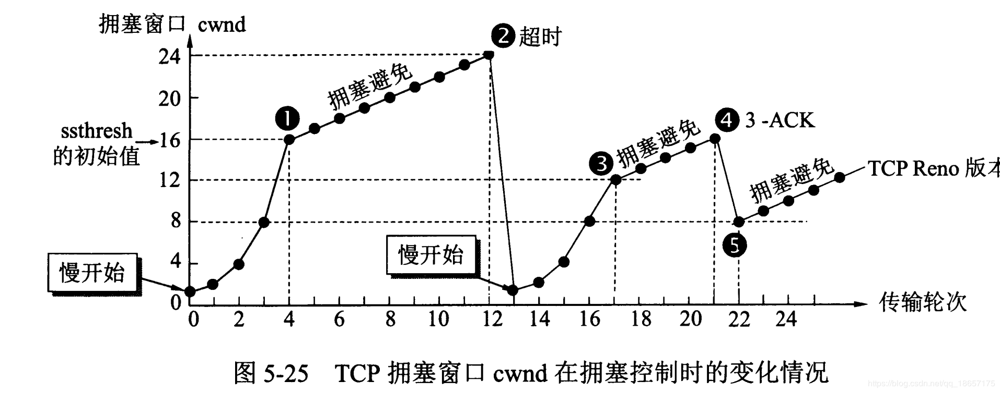
* 快恢复、快重传
在接收方，要求每次接收到报文段都应该对最后一个已收到的有序报文段进行确认。例如已经收到M1和M2，此时收到M4，应当发送对M2的确认，因为M3在传输过程中丢失了，所以收到M4报文后还是发送M2的确认。如果发送方连续收到三个M2的重复确认，那么可以知道是M3报文段丢失，此时执行快重传，立即重传M3报文段。  
在这种情况下，只是丢失个别报文段，而不是网络拥塞。因此执行快恢复，令门限sshtresh = cwnd/2，令拥塞窗口直接为门限ssthresh值，即cwnd = ssthresh，此时直接进入了拥塞避免，而不需要执行慢开始。  
满开始和快恢复的快慢只的是cwnd的设定值，而不是cwnd的增长速率。慢开始cwnd设定为1，而快恢复cwnd设定为sshtresh。
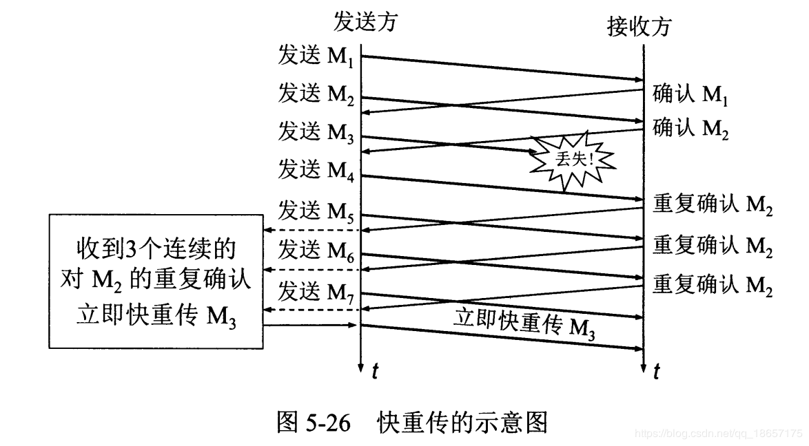

## DNS

什么是DNS解析？  
域名到IP地址的映射，DNS解析是应用层协议，DNS解析请求采用UDP数据报，且**明文**。  

DNS解析查询方式？  

* 递归查询
就是DNS域名服务器层层向上查询。查询本地DNS -> 根域DNS -> 顶级DNS -> 权限DNS
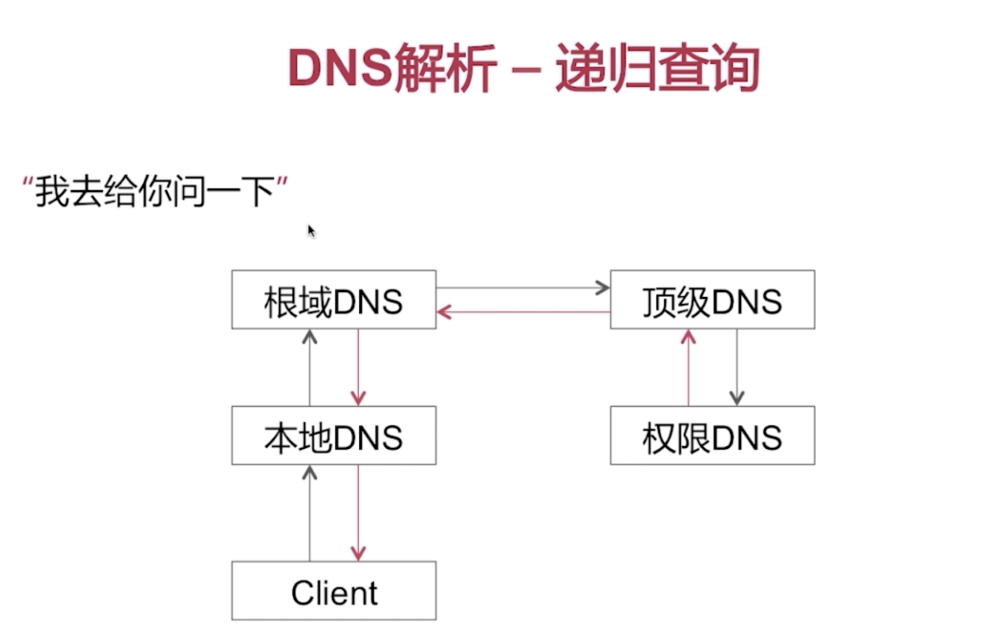
* 迭代查询
就是如果本地DNS查询不到IP就去挨个询问其他DNS。
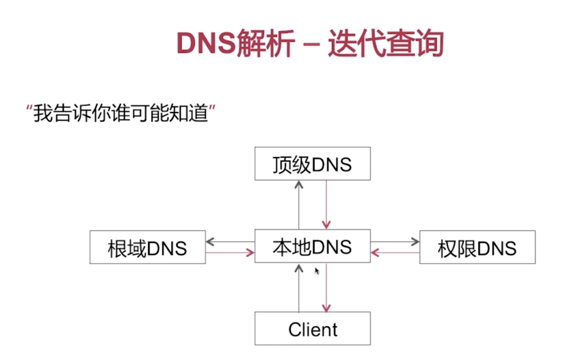

DNS解析存在哪些常见的问题？  

* DNS劫持问题
* DNS解析转发问题

DNS劫持：  

DNS劫持与HTTP的关系是怎样的？  
没有关系，DNS解析发生在HTTP建立连接之前，DNS解析请求使用UDP数据报，端口号是53

如何防止DNS劫持？  

* 可以通过httpDNS来解析IP，而不使用运营商的UDP来解析  
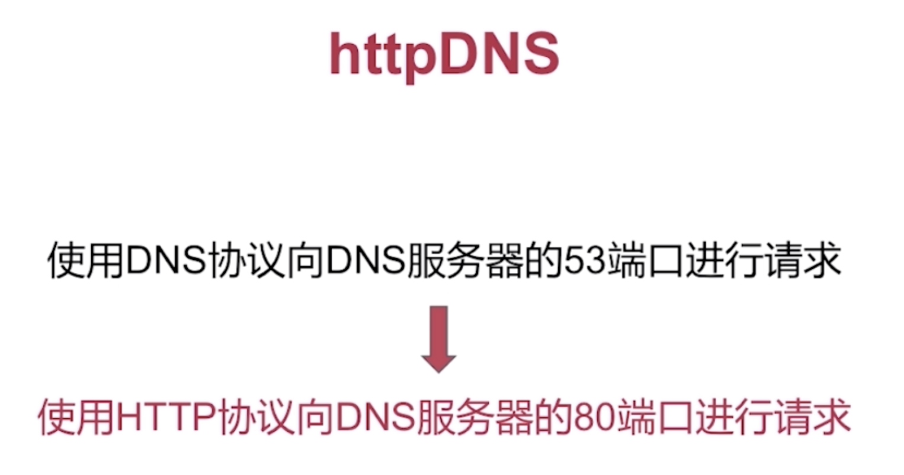
* 长连接
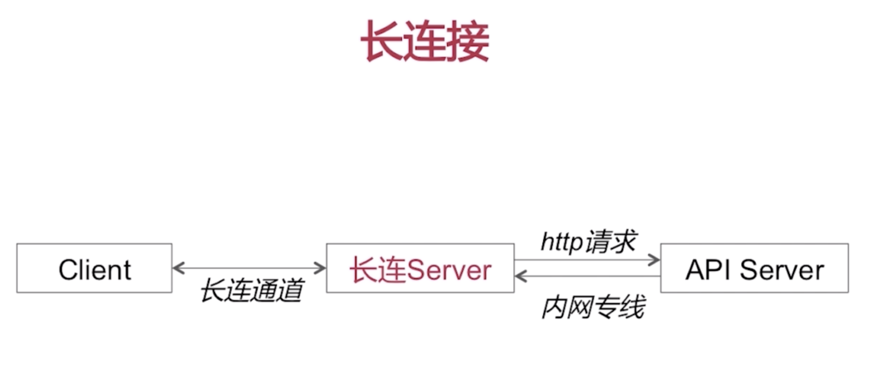

DNS解析转发  
DNS在访问本地域名服务器时，为了节省资源，它会把解析转发给其他域名服务器。
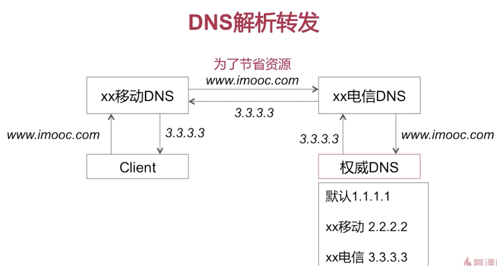

## Session与Cookie

### Cookie

Cookie主要用来记录用户状态，区分用户；状态保存在客户端。
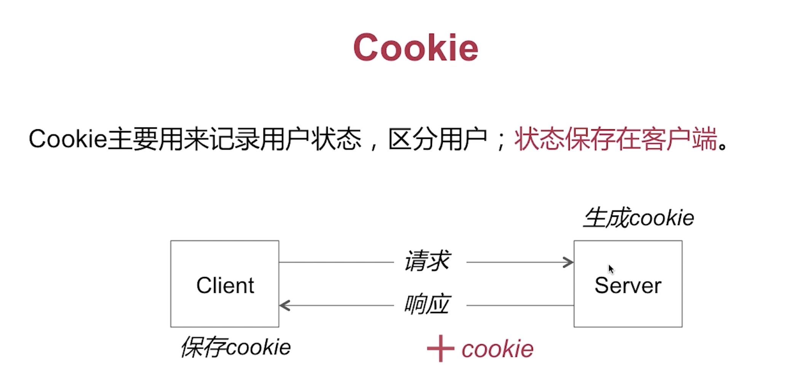
客户端发送的cookie在http请求报文的Cookie首部字段中  
服务端设置http响应报文的Set-Cookie首部字段  

怎么修改Cookie？
新cookie覆盖旧cookie  
覆盖规则：name、path、domain等需要与原cookie一致

怎样删除Cookie？  
新cookie覆盖旧cookie
覆盖规则：name、path、domain等需要与原cookie一致  
设置cookie的expires=过去的一个时间点，或者maxAge=0

怎样保证Cookie的安全？

* 对Cookie进行加密处理
* 只在https上携带Cookie
* 设置Cookie为httpOnly，防止跨站脚本攻击

### Session

Session也是用来记录用户状态，区分用户的；状态存放在服务器端。  

Session和Cookie的关系是怎样的？  
Session需要依赖于Cookie机制  

Session工作流程
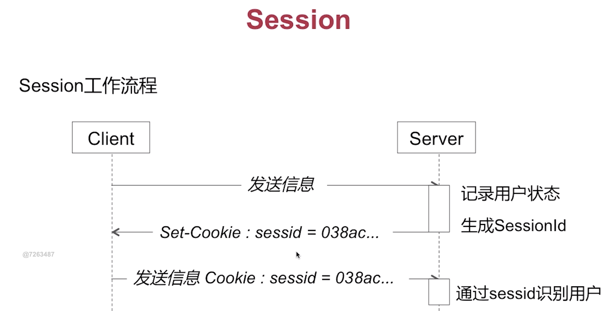

## Socket通信

建立Socket连接至少需要一对套接字，分别运行于服务端和客户端。套接字直接的连接过程分为三个步骤：

1. 服务端Socket始终处于等待连接状态，实时监听是否有客户端请求连接
2. 客户端Socket提出连接请求，指定服务端Socket的地址和端口号，这时就可以向对应的服务端提出Socket连接请求。
3. 当服务端Socket监听到客户端Socket提出的连接请求时作出相应，建立一个新的进程，把服务端Socket的描述发送给客户端，该描述得到客户端确认后就可以建立起Socket连接。而服务端Socket则继续处于监听状态，继续接受其他客户端Socket的请求。

## HTTP断点续传原理

1.浏览器请求服务器上的一个文件名为test.zip时，部分请求头是这样的：
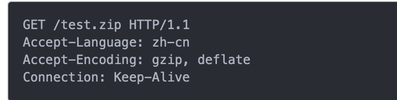
有连接状态、编码格式
2.服务器收到请求后，按要求寻找文件并提取文件的信息，然后返回给浏览器：
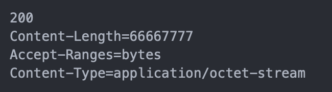
有请求内容长度，内容类型  
为了实现从文件已经下载的地方开始继续下载。所以在客户端传给服务器的时候要多加一条信息--从哪里开始。下面是客户端请求时的请求信息，要求从44445555字节开始。
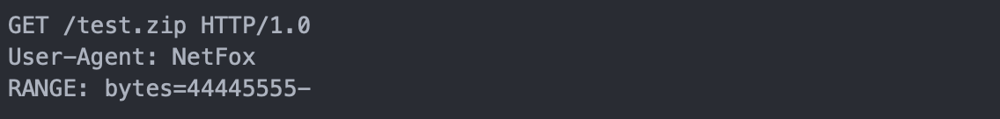
上面的请求信息多了一个新的字段RANGE:bytes=44445555-，这段话的意思就是告诉服务器test.zip这个文件从44445555字节开始传，前面的字节不用传了。
