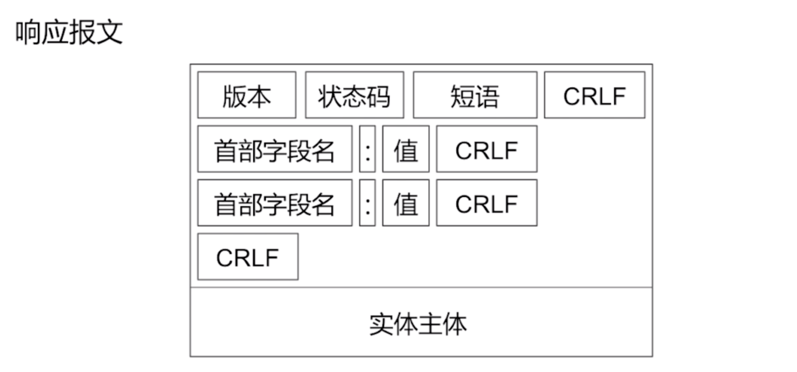

# 网络

## HTTP原理

超文本传输协议

### 请求/响应报文

请求报文格式

响应报文格式

### 请求方式

GET/POST/HEAD/PUT/DELETE/OPTIONS

### GET和POST区别

GET：获取资源  
安全的、幂等的、可缓存的
POST：处理资源
非安全的、非幂等的、不可缓存的

安全性：不应该引起Server端的任何状态变化，如GET、HEAD、OPTIONS
幂等性：同一个请求方法执行多次和执行一次的效果完全相同，如PUT、DELETE  
可缓存性：请求是否可以被缓存。  GET、HEAD

* 连接建立流程
* HTTP的特点

### HTTP2与HTTP1.1的区别

1.HTTP2使用的是二进制传送，HTTP1.X是文本（字符串）传送。

大家都知道HTTP1.X使用的是明文的文本传送，而HTTP2使用的是二进制传送，二进制传送的单位是帧和流。帧组成了流，同时流还有流ID标示，通过流ID就牵扯出了第二个区别

2.HTTP2支持多路复用

因为有流ID，所以通过同一个http请求实现多个http请求传输变成了可能，可以通过流ID来标示究竟是哪个流从而定位到是哪个http请求

3.HTTP2头部压缩

HTTP2通过gzip和compress压缩头部然后再发送，同时客户端和服务器端同时维护一张头信息表，所有字段都记录在这张表中，这样后面每次传输只需要传输表里面的索引Id就行，通过索引ID就可以知道表头的值了

4.HTTP2支持服务器推送

### 状态消息

1xx:信息
消息 | 描述
- | - |
100 Continue | 服务器仅接收到部分请求，但是一旦服务器并没有拒绝该请求，客户端应该继续发送其余的请求。
101 Switching Protocols | 服务器转换协议：服务器将遵从客户的请求转换到另外一种协议。
2xx:成功
消息 | 描述
- | - |
200 OK | 请求成功
201 Created | 请求被创建完成，同时新的资源被创建。
3xx:重定向
消息 | 描述
- | - |
301 Moved Permanently | 所请求的页面已经转移至新的url。永久重定向
302 Found | 所请求的页面已经临时转移至新的url。临时重定向
303 See Other | 所请求的页面可在别的url下被找到。
304 Not Modified | 资源未修改
4xx:客户端错误
消息 | 描述
- | - |
400 Bad Request | 服务器未能理解请求。
401 Unauthorized | 被请求的页面需要用户名和密码。
403 Forbidden | 对被请求页面的访问被禁止。
404 Not Found | 服务器无法找到被请求的页面。
5xx:服务器错误
消息 | 描述
- | - |
500 Internal Server Error | 请求未完成。服务器遇到不可预知的情况。
501 Not Implemented | 请求未完成。服务器不支持所请求的功能。
502 Bad Gateway | 请求未完成。服务器从上游服务器收到一个无效的响应。
503 Service Unavailable | 请求未完成。服务器临时过载或当机。
504 Gateway Timeout | 网关超时。

### 连接建立流程  

### HTTP的特点

* 无连接，每次请求完成之后连接都断开了，基于此，我们如何实现HTTP的持久连接呢？
* 无状态，两次请求服务器是不知道是不是同一个用户的，基于此我们如何保存用户的状态呢？Cookie/Session

#### 持久连接

所涉及的头部字段  
Connection: keep-alive  //持久连接  
time: 20  //20秒后关闭  
max: 10  //最多可以发送10个请求  

怎样判断持久连接中一个请求是否结束的？  

1. 通过响应报文中的Content-length来判断所接收的数据是否接收完成来判断请求结束。
2. 多次响应中头部有chunked，当有多个块通过http的tcp连接传输给客户端的时候，每个报文都有chunked字段，最后一个会有空的chunked，通过chunked为空来判断请求是否结束。

Charles抓包原理是怎样的？  
是通过http的中间人攻击这种漏洞来进行实现的。  

中间人攻击的定义：  
中间人攻击是指攻击者与通讯的两端分别创建独立的联系，并交换其所收到的数据，使通讯的两端认为他们正在通过一个私密的连接与对方直接对话，但事实上整个会话都被攻击者完全控制。

#### 保存状态

所谓cookie是为了辨别用户身份、进行session跟踪而储存在用户本地终端上的数据  
Cookie是服务器返回，客户端存在内存的，可以使用`[[NSHTTPCookieStorage sharedHTTPCookieStorage] setCookie:userCookie]`保存，但是会因为过期下次启动可能就失效了，所以最好使用NSUserDefault保存。  

### HTTPS和HTTP有怎样的区别

HTTPS = HTTP + SSL/TLS

HTTPS连接建立流程是怎样的？  

1. 首先客户端向服务器发送自己的TLS版本号、支持的加密算法、随机数C
2. 服务器拿到随机数后用私钥进行加密把加密后的随机数S返回给客户端，并同时给客户端返回一个数字证书，以及商定的加密算法
3. 客户端拿到数字证书后验证其合法性
4. 客户端拿到随机数后用公钥进行解密，并和之前的随机数进行对比
5. 客户端通过加密算法生成预主密钥，并和前两个随机数一起组装成会话秘钥保存
6. 客户端将预主密钥通过公钥加密发送给服务器
7. 服务器收到预主密码用私钥解密之后，和之前的两个随机数一起组装成会话秘钥保存
8. 客户端发送加密的握手消息
9. 服务端返回一个加密的握手消息来验证安全通道是否已经建立完成。

### 如何防止HTTPS抓包

HTTPS抓包主要是中间人安装了一个根证书，当你安装该根证书之后，该证书机构颁发的其他证书默认都会被你的系统信任，这是HTTPS抓包的重要前提！！  
那么客户端怎么防止被抓包呢？有两种方式：  

1. 可以在进行网络请求的时候，客户端判断当前是否设置了代理，如果设置了代理，不允许进行访问。  
2. 客户端本地做证书校验，并不只是校验公钥。

## TCP与UDP

## DNS

## Session与Cookie

## AFNetworking和Alamofire中的HTTPS

## Socket通信

## 网络下载原理
